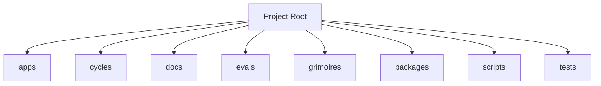

<!-- AGENT-CONTEXT
name: freeside-characters
type: framework
purpose: Participation-agent umbrella for the HoneyJar ecosystem. Substrate (persona-engine) + characters (ruggy, satoshi, ...) + Discord bot runtime.
key_files: [CLAUDE.md, .claude/loa/CLAUDE.loa.md, .loa.config.yaml, .claude/scripts/, .claude/skills/, package.json]
interfaces:
dependencies: [git, jq, yq, node]
version: v0.12.0
installation_mode: submodule
trust_level: L2-verified
-->

# freeside-characters

<!-- provenance: CODE-FACTUAL -->
Participation-agent umbrella for the HoneyJar ecosystem. Substrate (persona-engine) + characters (ruggy, satoshi, ...) + Discord bot runtime.

Built with TypeScript/JavaScript, Python, Shell.

## Key Capabilities
<!-- provenance: CODE-FACTUAL -->

### API Surface — freeside-characters
#### HTTP Routes (`apps/bot/src/discord-interactions/server.ts:62-86`)
- Method — Path — Purpose — Auth
- GET — `/health` — Health probe — none
- POST — `/webhooks/discord` — Discord interactions endpoint — Ed25519 (Discord public key)
#### Slash Commands
- Command — Handler — Owner — Options
- `/ruggy` — chat — ruggy — prompt:string · ephemeral?:bool
- `/satoshi` — chat — satoshi — prompt:string · ephemeral?:bool
- `/satoshi-image` — imagegen — satoshi — prompt:string
- `/mongolian` — chat — mongolian — prompt:string · ephemeral?:bool (default fallback)
- `/quest` (+ buttons + modal_submit) — quest — system — intercepted before character routing
#### Public Module API (`packages/persona-engine/src/index.ts`)
##### Compose
- `composeForCharacter(config, character, zone, postType)` — digest path · full MCP, maxTurns 12
- `composeReply({config, character, prompt, channelId, zone?, ...})` — chat path
- `composeReplyWithEnrichment(...)` — V0.7-A.3 env-aware enrichment
- `composeWithImage(...)` — satoshi imagegen attachment payload
- `compose(args)` — V0.7-A.2 unified dispatcher
- `splitForDiscord(text)` — chunk into 2000-char-safe slices

## Architecture
<!-- provenance: CODE-FACTUAL -->
The architecture follows a three-zone model: System (`.claude/`) contains framework-managed scripts and skills, State (`grimoires/`, `.beads/`) holds project-specific artifacts and memory, and App (`src/`, `lib/`) contains developer-owned application code.

Directory structure:
```
./apps
./apps/bot
./apps/character-akane
./apps/character-kaori
./apps/character-mongolian
./apps/character-nemu
./apps/character-onboarding
./apps/character-ren
./apps/character-ruan
./apps/character-ruggy
./apps/character-satoshi
./cycles
./cycles/cycle-3052966d80
./cycles/cycle-3052978825
./cycles/cycle-305298c82d
./cycles/cycle-305346d495
./cycles/cycle-30553656b9
./cycles/cycle-3080686a1b
./docs
./docs/admission-wedge
./docs/recall-wedge
./evals
./evals/snapshots
./grimoires
./grimoires/k-hole
./grimoires/loa
./packages
./packages/persona-engine
./packages/protocol
./scripts
```

## Module Map
<!-- provenance: CODE-FACTUAL -->
| Module | Files | Purpose | Documentation |
|--------|-------|---------|---------------|
| `apps/` | 529 | Documentation | \u2014 |
| `cycles/` | 37 | Documentation | \u2014 |
| `docs/` | 86 | Documentation | \u2014 |
| `evals/` | 11 | Evaluation suites and benchmarks | \u2014 |
| `grimoires/` | 274 | Loa state and memory files | \u2014 |
| `packages/` | 385 | Packages | \u2014 |
| `scripts/` | 22 | Utility scripts | \u2014 |
| `tests/` | 1 | Test suites | \u2014 |

## Verification
<!-- provenance: CODE-FACTUAL -->
- Trust Level: **L2 — CI Verified**
- 6 test files across 1 suite
- CI/CD: GitHub Actions (1 workflows)
- Type safety: TypeScript

## Ecosystem
<!-- provenance: OPERATIONAL -->
### Dependencies
- `@types/bun`
- `typescript`

## Quick Start
<!-- provenance: OPERATIONAL -->
Available commands:

- `npm run postinstall` — bash
- `npm run dev` — bun
- `npm run start` — bun
- `npm run build` — bun
- `npm run test` — bun
<!-- ground-truth-meta
head_sha: 90f8b14ebbe44fe8eb52844c7daea8322780dc6f
generated_at: 2026-07-07T05:26:47Z
generator: butterfreezone-gen v1.0.0
sections:
  agent_context: e8123c7956dc083ff1f2af3355283faa0e56f4ebb19d40f86365404ce6644056
  capabilities: e511ca49f80223784f6be21354f3992834452bee81445d7630246accc623f095
  architecture: 924eddb752d0946cba790f24b3c2493f75e4229dcb27d5fd6e2d34fe41aa3dad
  module_map: fa2ebf17ebf4be7f11ba038d16df5c0a64b490548241b03998f6336a3fb02927
  verification: 6416965dff1863f99bddfc009ffb621a92a70d356d0c01b49708c7b8b99e0cdd
  ecosystem: 1c0d537145b1d9f3d66a0a06c70e8031744e053e9a5cec570cd180d813ae8da2
  quick_start: f80a5046e376be2ef6be80dbb5ccc81fe70b60c9312ed714cfe0c84e656add1d
-->
