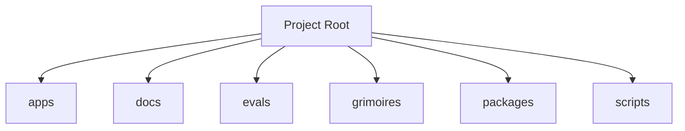

<!-- AGENT-CONTEXT
name: freeside-characters
type: framework
purpose: Participation-agent umbrella for the HoneyJar ecosystem. Substrate (persona-engine) + characters (ruggy, satoshi, ...) + Discord bot runtime.
key_files: [CLAUDE.md, .claude/loa/CLAUDE.loa.md, .loa.config.yaml, .claude/scripts/, .claude/skills/, package.json]
interfaces:
dependencies: [git, jq, yq, node]
version: v0.11.3
installation_mode: submodule
trust_level: L1-tests-present
-->

# freeside-characters

<!-- provenance: CODE-FACTUAL -->
Participation-agent umbrella for the HoneyJar ecosystem. Substrate (persona-engine) + characters (ruggy, satoshi, ...) + Discord bot runtime.

Built with TypeScript/JavaScript, Python, Shell.

## Key Capabilities
<!-- provenance: CODE-FACTUAL -->

# API Surface — freeside-characters
## HTTP Routes (`apps/bot/src/discord-interactions/server.ts:62-86`)
<!-- provenance: CODE-FACTUAL -->
- `POST /webhooks/discord` — Ed25519-verified slash-command webhook (V0.7-A.0 listener-substrate)
- `GET /health` — liveness probe for runtime monitoring

## Slash Commands
<!-- provenance: CODE-FACTUAL -->
- `/ruggy <prompt>` — invoke the ruggy persona for an explicit reply (festival NPC narrator)
- `/satoshi <prompt>` — invoke the satoshi persona (mibera-codex agent · locked register)
- Anti-spam invariant: characters NEVER respond unsolicited · only on explicit `/<character>` invocation

## Public Module API (`packages/persona-engine/src/index.ts`)
<!-- provenance: CODE-FACTUAL -->
Substrate exports consumed by the bot runtime. Stable boundary — changes here cascade across apps/.
### Compose
- `composeForCharacter(config, character, zone, postType)` — digest path · full MCP, maxTurns 12
- `composeReply({config, character, prompt, channelId, zone?, ...})` — chat path
- `composeReplyWithEnrichment(...)` — V0.7-A.3 env-aware enrichment
- `composeWithImage(...)` — satoshi imagegen attachment payload
- `compose(args)` — V0.7-A.2 unified dispatcher
- `splitForDiscord(text)` — chunk into 2000-char-safe slices
### Cron
- `schedule({config, zones, onFire})` — start 3 cadences (digest · pop-in · weaver)
### Delivery
- `deliverZoneDigest(config, character, zone, payload)` — digest path delivery
- `getBotClient(config)` / `shutdownClient()` — discord.js lifecycle
- `getOrCreateChannelWebhook(client, channelId)` — Pattern B webhook fetch-or-create
- `sendChatReplyViaWebhook(...)` / `sendImageReplyViaWebhook(...)` — chat-mode delivery
- `invalidateWebhookCache(channelId)` — admin-deleted-webhook recovery

### Persona
- `loadCharacter(path)` — load CharacterConfig from `apps/character-<id>/`
- `loadSystemPrompt(character, shape)` — render persona-grounded system prompt for LLM call

### Zone Registry (cycle-007 S1)
- `ZONE_REGISTRY[zone]` — canonical zone-display map (4 zones · frozen)
- `resolveZoneDisplayName(zone) / resolveZoneRichLabel(zone)` — strict resolvers · throw `UnknownZoneError` on unknown
- `safeResolveZoneDisplayName(zone, caller) / safeResolveZoneRichLabel(zone, caller)` — SKP-003 safe variants with OTEL counter + raw-fallback
- `detectKebabZoneIds(text)` — SINK-side kebab-leak detector for sanitize chain (NFKC + Unicode-dash normalized · IMP-002 false-positive allowlist)

## Architecture
<!-- provenance: CODE-FACTUAL -->
The architecture follows a three-zone model: System (`.claude/`) contains framework-managed scripts and skills, State (`grimoires/`, `.beads/`) holds project-specific artifacts and memory, and App (`src/`, `lib/`) contains developer-owned application code.

Directory structure:
```
./apps
./apps/bot
./apps/character-akane
./apps/character-kaori
./apps/character-mongolian
./apps/character-nemu
./apps/character-ren
./apps/character-ruan
./apps/character-ruggy
./apps/character-satoshi
./docs
./evals
./evals/snapshots
./grimoires
./grimoires/k-hole
./grimoires/loa
./packages
./packages/persona-engine
./packages/protocol
./scripts
./scripts/construct-adapter-gen
```

## Module Map
<!-- provenance: CODE-FACTUAL -->
| Module | Files | Purpose | Documentation |
|--------|-------|---------|---------------|
| `apps/` | 111 | Documentation | \u2014 |
| `docs/` | 13 | Documentation | \u2014 |
| `evals/` | 10 | Evaluation suites and benchmarks | \u2014 |
| `grimoires/` | 186 | Loa state and memory files | \u2014 |
| `packages/` | 181 | Upackages | \u2014 |
| `scripts/` | 11 | Utility scripts | \u2014 |

## Verification
<!-- provenance: CODE-FACTUAL -->
- Trust Level: **L1 — Tests Present**
- 3 test files across 0 suite
- Type safety: TypeScript

## Ecosystem
<!-- provenance: OPERATIONAL -->
### Dependencies
- `@types/bun`
- `typescript`

## Known Limitations
<!-- provenance: CODE-FACTUAL -->
- No CI/CD configuration detected

## Quick Start
<!-- provenance: OPERATIONAL -->
Available commands:

- `npm run dev` — bun
- `npm run start` — bun
- `npm run build` — bun
- `npm run test` — bun
<!-- ground-truth-meta
head_sha: 3324a8df649a538499d2e21e9a2bd3f13166347b
generated_at: 2026-05-17T05:56:32Z
generator: butterfreezone-gen v1.0.0
sections:
  agent_context: 1982896dda7931e0530b8aaf02349bd4e9cbc48e2e3638d9c6591fa38444ee5b
  capabilities: 91d6be65a3a4da064e6c0faf2c0c22e2492493e43e0fcba69260dc982b2d37ab
  architecture: b53dd5b12fc694c359c121d083aaa98d91c64d8007511e7799d3c8562aac1f56
  module_map: 5677316af51ec44997a732fa2a5d75b8e393d29b26c4ca9a3381b05d8cb81407
  verification: c5f36143ff689e7b36d16124560e05a86a92188ac5c3c2129553102b3a25be48
  ecosystem: 1c0d537145b1d9f3d66a0a06c70e8031744e053e9a5cec570cd180d813ae8da2
  limitations: 9c90b6be59e78deec3e3cd4c56edde5a5b6efaa3807225839916bde71ef89624
  quick_start: eade50bb4d2a23f52903ea46cb5f7afc98b9d6795d48f48ee4ece1a0e5dff6db
-->
