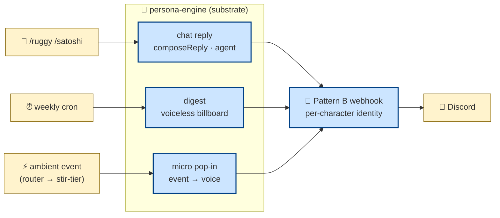
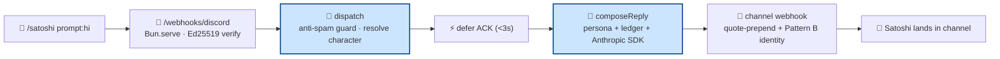

# freeside-characters

Participation-agent umbrella for the Honey Jar ecosystem — a multi-character
Discord presence built on one shared substrate.

- **Substrate** — `packages/persona-engine/` — the system-agent layer: cron,
  MCP orchestration, prompt composition, delivery, observability. It does the
  plumbing; it never speaks.
- **Characters** — `apps/character-<id>/` — the participation-agent layer:
  markdown personas + lore + register-locks. They supply voice; they never
  touch Discord.
- **Bot runtime** — `apps/bot/` — a thin loader that wires both into Discord
  (Gateway + interactions HTTP + per-character webhook identity).

The boundary is the `CharacterConfig` type contract (`persona-engine/src/types.ts`).
Characters never import substrate internals — see [`docs/CIVIC-LAYER.md`](docs/CIVIC-LAYER.md).

**Live today:** **ruggy** (festival NPC narrator, lowercase OG voice) and
**satoshi** (mibera-codex agent, sentence-case cypherpunk register), both in the
THJ Discord. Six more personas are authored as scaffolds under `apps/character-*/`
(`akane · kaori · ren · ruan · nemu · mongolian`); the live roster is whatever
the `CHARACTERS` env names (default `ruggy`).

## Three surfaces (the load-bearing mental model)

A character meets the world through exactly three surfaces, and they never blend
— the "muddy middle" reads too bot. Each surface has a different job:

| Surface | Trigger | What it is | Voice? |
|---|---|---|---|
| **Chat** | `/ruggy` · `/satoshi` slash command | an agent reply to a user, in character | ✅ full voice |
| **Scheduled** | weekly cron per zone | the digest — a data **billboard** (Components V2) | ❌ voiceless by design |
| **Event** | ambient semantic event | a micro pop-in reacting to something that just happened | ✅ short voice |

The weekly **digest is voiceless on purpose** (operator pivot, cycle-007): it
mirrors the score-dashboard card layout faithfully — no LLM call, no narrative.
The character's voice lives in **chat** (you summoned it) and **event** pop-ins
(it reacted), never in the scheduled billboard.



## What the substrate is made of

The character loop pulls from single-discipline pieces at compose time
(UNIX-like boundaries — each owns one thing):

| Piece | Owns | Lives in |
|---|---|---|
| **orchestrators** | per-post-type composition (digest · micro · pop-in · weaver · …) | `persona-engine/src/orchestrator/` |
| **ambient** | the event stream — router decides when to fire a pop-in (pull, cursor-tail) | `persona-engine/src/ambient/` |
| **score** (remote MCP) | activity digests, factor/dimension catalogs — the numbers | `score-api-production` |
| **freeside_auth** (in-process MCP) | wallet → handle / discord / mibera_id resolution against `midi_profiles` | `persona-engine/src/orchestrator/freeside_auth/` |
| **deliver** | Discord-as-Material: sanitize, embed/Components V2, Pattern B webhook | `persona-engine/src/deliver/` |
| **voice / persona** | register-locks, prompt composition, per-character voice | `persona-engine/src/{voice,persona}/` |
| **observability** | trace envelope + a substrate-native local trace dashboard | `persona-engine/src/observability/` |
| **preview** | the RLHF iteration surface — refine "too raw from score" output Discord-natively | `persona-engine/src/preview/` |

**Quests** are a separate, env-gated capability in the bot: one binary, N worlds,
per-world DB isolation (`@0xhoneyjar/quests-engine`, worlds like mibera / apdao /
cubquest). Off by default — `QUEST_RUNTIME=disabled`; opt in with `memory` or
`production`.

**State has no database here.** It lives in score-mcp, `midi_profiles`, and
`.run/` jsonl caches; the conversation ledger is in-process per channel.

## One shell, many speakers (codified · ecosystem-health cycle 001)

The substrate is shared. Characters diverge ONLY at the markdown/JSON profile
layer — they share boot-time, prompt composition, anti-spam, ledger, MCP wiring,
and Discord interaction handling.

**The umbrella rule** — a new character earns a spot in this repo when it's a
Discord persona consuming the same delivery substrate, its voice+lore fit
`apps/character-<id>/` markdown, and its runtime needs don't diverge from the
`CharacterConfig` contract. Adding one is a new directory + a `CHARACTERS` entry —
no new repo. See [`docs/CHARACTER-AUTHORING.md`](docs/CHARACTER-AUTHORING.md).

A character splits into its own repo only if its runtime diverges (non-Discord
surface · custom LLM ensemble · realtime audio), its lifecycle drifts (independent
versioning · separate auth), or the umbrella starts working against it. Until
then, the umbrella is the default; the split is the exception.

## The anti-spam invariant (never auto-respond)

Characters respond ONLY to explicit user invocations. Bot-author messages skip.
Webhook-author messages skip. Channel presence alone never triggers a reply.
This rule survives every phase — `apps/bot/src/discord-interactions/dispatch.ts`
enforces it. The scheduled + event surfaces are the substrate's own cadence, not
a response to chatter.



## Run it locally

```bash
bun install
cp .env.example .env

# stub mode — no external deps, verify the pipeline end-to-end
LLM_PROVIDER=stub bun run digest:once

# anthropic-direct — real LLM, stub data, canned ZoneDigest
LLM_PROVIDER=anthropic ANTHROPIC_API_KEY=sk-… STUB_MODE=true bun run digest:once

# full bot — digest cron + slash interactions
ANTHROPIC_API_KEY=sk-…          # or LLM_PROVIDER=bedrock when wired
DISCORD_BOT_TOKEN=…             # Gateway + webhook permissions
DISCORD_PUBLIC_KEY=…            # Ed25519 interaction verification
CHARACTERS=ruggy,satoshi
bun run --cwd apps/bot start
```

`bun run typecheck` · `bun test` · `bun run lint:cycle-007` (the substrate's own
invariant linters) gate every change. Slash-command setup walkthrough:
[`docs/DISCORD-INTERACTIONS-SETUP.md`](docs/DISCORD-INTERACTIONS-SETUP.md).

## Where to read more

| Doc | What |
|---|---|
| [`docs/AGENTS.md`](docs/AGENTS.md) | **Start here** — landing page for agents working in this repo |
| [`docs/ARCHITECTURE.md`](docs/ARCHITECTURE.md) | Substrate + character + delivery, full picture |
| [`docs/CIVIC-LAYER.md`](docs/CIVIC-LAYER.md) | Why substrate ≠ character (Eileen's civic-layer doctrine) |
| [`docs/CHARACTER-AUTHORING.md`](docs/CHARACTER-AUTHORING.md) | Adding a character to the umbrella |
| [`docs/MULTI-REGISTER.md`](docs/MULTI-REGISTER.md) | Per-character voice register locks |
| [`docs/EXPRESSION-TIMING.md`](docs/EXPRESSION-TIMING.md) | When characters speak (cadence + event timing) |
| [`docs/MCP-FEDERATION.md`](docs/MCP-FEDERATION.md) | score-mcp + freeside_auth wiring |
| [`docs/DISCORD-INTERACTIONS-SETUP.md`](docs/DISCORD-INTERACTIONS-SETUP.md) | Slash command setup |
| [`docs/trace-cli.md`](docs/trace-cli.md) · [`docs/raindrop-workshop-setup.md`](docs/raindrop-workshop-setup.md) | Observability — trace CLI + Raindrop Workshop |
| [`docs/DEPLOY.md`](docs/DEPLOY.md) · [`docs/PURUPURU-DEPLOY.md`](docs/PURUPURU-DEPLOY.md) | Railway / ECS deploy paths |
| [`CLAUDE.md`](CLAUDE.md) | Repo conventions for agents working here |

## Status

- 🟢 **digest = enriched-v2 billboard, live** — Components V2 card fed by real
  `raw_stats` (spotlight identity + NFT pfp, factor movers, members-warm footer)
- 🟢 **chat** — `/ruggy` `/satoshi` slash commands · Pattern B identity · in-process ledger
- 🟢 **event** — ambient router fires event-aware micro pop-ins
- 🟢 ruggy + satoshi live in THJ Discord; Opus 4.7 drives chat + event voice
- 🟡 **RLHF preference loop** — the standalone iteration surface (`preview/`) is the active workstream
- 🟡 quests (multi-world) wired, env-gated; Bedrock provider in design (Eileen's local-satoshi)

License: AGPL-3.0
