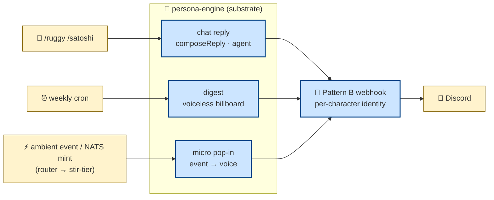
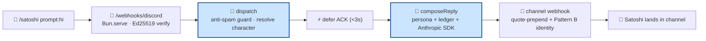

# freeside-characters

> Participation-agent umbrella for the Honey Jar ecosystem — a multi-character
> Discord presence built on one shared substrate.


```bash
git clone https://github.com/0xHoneyJar/freeside-characters
cd freeside-characters && bun install && cp .env.example .env
LLM_PROVIDER=stub bun run digest:once   # end-to-end, zero external deps
```

---

## TL;DR

**The problem.** You want several distinct AI characters — each with its own
face, voice, and lore — living in Discord, reacting to on-chain and community
activity. Doing that per-character means N bots, N deploys, N copies of the same
cron/MCP/delivery plumbing, and N places for the "voice" to leak into the
"plumbing."

**The solution.** One substrate, many speakers. A single system-agent layer
(`persona-engine`) owns everything mechanical — cron, MCP orchestration, prompt
composition, Discord delivery, observability. Characters are just markdown
personas + JSON config. One bot account wears each character's face per-message
via PluralKit-style webhook overrides (Pattern B). Adding a character is a new
directory and a `CHARACTERS=` entry — **not a new repo**.

| Layer | Path | Owns | Never does |
|---|---|---|---|
| **Substrate** | `packages/persona-engine/` | cron, MCP orchestration, compose, delivery, observability | *speak* |
| **Characters** | `apps/character-<id>/` | voice — persona.md + lore + register-locks | *touch Discord* |
| **Bot runtime** | `apps/bot/` | wire both into Discord (Gateway + interactions HTTP + webhooks) | *hold business logic* |

The single boundary between substrate and character is the `CharacterConfig`
type contract (`packages/persona-engine/src/types.ts`). Characters never import
substrate internals — see [`docs/CIVIC-LAYER.md`](docs/CIVIC-LAYER.md).

**Live today:** **ruggy** (festival NPC narrator, lowercase OG voice) and
**satoshi** (mibera-codex agent, sentence-case cypherpunk register) in the THJ
Discord, driven by Opus 4.7 for chat + event voice. Six more personas are
authored under `apps/character-*/` (`akane · kaori · ren · ruan · nemu ·
mongolian`); the live roster is whatever the `CHARACTERS` env names (default
`ruggy`).

---

## The three voice surfaces (the load-bearing mental model)

A character meets the world through exactly three **voice** surfaces, and they
never blend — the "muddy middle" reads too bot. Each has a different job:

| Surface | Trigger | What it is | Voice? |
|---|---|---|---|
| **Chat** | `/ruggy` · `/satoshi` slash command | an agent reply to a user, in character | ✅ full voice |
| **Scheduled** | weekly cron per zone | the digest — a data **billboard** (Components V2) | ❌ voiceless by design |
| **Event** | ambient semantic event / on-chain mint | a micro pop-in reacting to something that just happened | ✅ short voice |

The weekly **digest is voiceless on purpose** (operator pivot, cycle-007): it
mirrors the score-dashboard card layout faithfully — no LLM call, no narrative.
The character's voice lives in **chat** (you summoned it) and **event** pop-ins
(it reacted), never in the scheduled billboard.



---

## Beyond voice: the utility surfaces

Not everything the bot does is a character speaking. These are **substrate
capabilities** — mechanical, mostly voiceless, and each gated behind an env flag
so the voice roster keeps running whether or not they're wired:

| Capability | What it does | Where | Status |
|---|---|---|---|
| **Onboarding / verify** | a "doorman" flow — SIWE + OAuth wallet verification, state-token round-trip, verified-role grant | `persona-engine/src/onboarding/` · `apps/bot/src/verify/` · `apps/character-onboarding/` | built · env-gated (`verifyRuntime.enabled`), pre-cutover |
| **Role-sync** | mirror on-chain / identity roles into Discord roles | `apps/bot/src/shadow/` · `/role-sync` command | built · `ROLE_SYNC_ENABLED` |
| **Member-graph ingestion** | fuse Discord + on-chain holders + identity into one member graph (SHADOW-first) | `apps/bot/src/shadow/ingestion/` · `apps/bot/src/cli/member-graph.ts` | on-chain proven · `GATE-PKG` stub |
| **Mint events** | NATS subscriber → cross-API compose → event pop-in when a mint lands | `persona-engine/src/events/` (NATS mint subscriber) | wired · TLS + JWKS gated |
| **Recall-wedge** | Loa-Straylight cross-interface memory MVP — the sole live caller into Dixie's recall intake | `persona-engine/src/recall-wedge/` | operator/dev-only · leak-scanned, no Discord write |
| **Quests** | one binary, N worlds, per-world DB isolation (`@0xhoneyjar/quests-engine`) | `apps/bot/` quest runtime | off by default (`QUEST_RUNTIME=disabled`) |

> Owned guilds (Mibera/THJ, Purupuru) surface through the bot; non-owned guilds
> (e.g. Pythenians) surface member-graph data through the freeside dashboard +
> `/recall`, **not** the bot.
>
> **Trajectory:** these utility surfaces are voiceless and CM-controlled by
> design, and are extraction-bound — they'll separate out as their own Freeside
> building(s) (member-graph → `shadow-mode-api`; verify → a `freeside-onboarding`
> building), leaving this repo as the pure voice/persona daemon. They stay
> strictly isolated in the meantime (no persona inference, no voice).

---

## What the substrate is made of

The character loop pulls from single-discipline pieces at compose time
(UNIX-like boundaries — each owns one thing):

| Piece | Owns | Lives in |
|---|---|---|
| **orchestrators** | per-post-type composition (digest · micro · pop-in · weaver · …) | `persona-engine/src/orchestrator/` |
| **ambient** | the event stream — router decides when to fire a pop-in (pull, cursor-tail) | `persona-engine/src/ambient/` |
| **events** | NATS mint subscriber, MST kansei router, announcement dispatcher | `persona-engine/src/events/` |
| **score** (remote MCP) | activity digests, factor/dimension catalogs — the numbers | `score-api-production` |
| **freeside_auth** (in-process MCP) | wallet → handle / discord / mibera_id resolution against `midi_profiles` | `persona-engine/src/orchestrator/freeside_auth/` |
| **rosenzu / emojis** (in-process MCP) | Lynch spatial primitives · THJ guild emoji catalog | `persona-engine/src/orchestrator/{rosenzu,emojis}/` |
| **deliver** | Discord-as-Material: sanitize, embed/Components V2, Pattern B webhook | `persona-engine/src/deliver/` |
| **voice / persona** | register-locks, prompt composition, per-character voice | `persona-engine/src/{voice,persona}/` |
| **observability** | trace envelope + a substrate-native local trace dashboard | `persona-engine/src/observability/` |
| **preview** | the RLHF iteration surface — refine "too raw from score" output Discord-natively | `persona-engine/src/preview/` |

**LLM providers** are pluggable via `LLM_PROVIDER` — `stub` (canned), `anthropic`
(direct Agent SDK), `bedrock` (AWS, bedrock-first when AWS env is present, and
the backend for `/satoshi-image`), `freeside` (gateway), or `auto`.

**State has no database here.** It lives in score-mcp, `midi_profiles`, and
`.run/` jsonl caches; the conversation ledger is in-process per channel.

---

## The anti-spam invariant (never auto-respond)

Characters respond ONLY to explicit user invocations. Bot-author messages skip.
Webhook-author messages skip. Channel presence alone never triggers a reply.
This rule survives every phase — `apps/bot/src/discord-interactions/dispatch.ts`
enforces it. The scheduled + event surfaces are the substrate's own cadence, not
a response to chatter.



The interaction path also carries a **circuit breaker** (3 consecutive 403s →
channel blacklist until restart), a follow-up throttle, and a 5-minute replay
window on the Ed25519 signature — see `discord-interactions/server.ts` +
`dispatch.ts`.

---

## Run it locally

```bash
bun install
cp .env.example .env

# 1. stub mode — no external deps, verify the whole pipeline end-to-end
LLM_PROVIDER=stub bun run digest:once

# 2. anthropic-direct — real LLM, stub data, canned ZoneDigest
LLM_PROVIDER=anthropic ANTHROPIC_API_KEY=sk-… STUB_MODE=true bun run digest:once

# 3. real data path — score-mcp + anthropic + Discord (or webhook fallback / stdout)
LLM_PROVIDER=anthropic ANTHROPIC_API_KEY=… STUB_MODE=false MCP_KEY=… bun run digest:once

# 4. full bot — digest cron + slash interactions
ANTHROPIC_API_KEY=sk-…          # or LLM_PROVIDER=bedrock when AWS-wired
DISCORD_BOT_TOKEN=…             # Gateway + webhook permissions
DISCORD_PUBLIC_KEY=…            # Ed25519 interaction verification
CHARACTERS=ruggy,satoshi
bun run start
```

`digest:once` fires one post per zone and exits — the fastest voice-iteration
loop (no waiting for Sunday midnight). Validate the whole pipeline in stub mode
before touching production cron cadences.

---

## Commands & scripts

```bash
bun run dev            # bot with --watch
bun run start          # bot runtime (Gateway + interactions server)
bun run digest:once    # one digest per zone, then exit
bun run typecheck      # persona-engine + bot, strict
bun test               # ~145 test files across the monorepo
bun run lint:cycle-007 # the substrate's own invariant linters (see below)
bun run trace:latest   # inspect the most recent local LLM trace
bun run discord:invite # print the bot invite link
```

**Slash commands** (auto-published on boot when `AUTO_PUBLISH_COMMANDS` is set):

| Command | Handler | Notes |
|---|---|---|
| `/ruggy` `/satoshi` `/akane` `/kaori` `/mongolian` `/nemu` `/ren` `/ruan` | `chat` | per-character voice reply — `prompt:string`, `ephemeral?:bool` |
| `/satoshi-image` | `imagegen` | Bedrock text-to-image attachment |
| `/quest` | system | intercepted before character routing (buttons + modals) |
| `/onboard` · `/role-sync` | system | utility flows (verify + role mirror) |

**Invariant linters** (CI-gated in `.github/workflows/ci.yml`):

| Script | Guards |
|---|---|
| `lint:seam` | the substrate↔presentation seam — the deterministic renderer must not import voice modules |
| `lint:zone-source` | no raw kebab `ZoneId` literals in voice prompts (AST lint, defeats escape/template evasion) |
| `lint:manifest-monotonic` | the voice-prompt path manifest can only grow (no de-listing to smuggle ZoneIds) |
| `lint:append-discipline` | `trace-envelope.ts` is the sole JSONL writer in the substrate |

---

## One shell, many speakers (the umbrella rule)

The substrate is shared. Characters diverge ONLY at the markdown/JSON profile
layer — they share boot-time, prompt composition, anti-spam, ledger, MCP wiring,
and Discord interaction handling.

**A new character earns a spot in this repo** when it's a Discord persona
consuming the same delivery substrate, its voice+lore fit
`apps/character-<id>/` markdown, and its runtime needs don't diverge from the
`CharacterConfig` contract. Adding one is a new directory + a `CHARACTERS` entry.
See [`docs/CHARACTER-AUTHORING.md`](docs/CHARACTER-AUTHORING.md).

A character **splits into its own repo** only if its runtime diverges (non-Discord
surface · custom LLM ensemble · realtime audio), its lifecycle drifts (independent
versioning · separate auth), or the umbrella starts working against it. Until
then, the umbrella is the default; the split is the exception.

---

## Repo layout

```
apps/
  bot/                     Discord runtime binary (entry: src/index.ts)
    src/discord-interactions/  Bun.serve HTTP + Ed25519 verify + slash dispatch
    src/shadow/                SHADOW-first role-sync + member-graph ingestion
    src/verify/                onboarding SIWE/OAuth web routes
    src/cli/                   digest-once · rlhf-preview · member-graph
  character-ruggy/         primary narrator (default CHARACTERS)
  character-satoshi/       cypherpunk codex agent + /satoshi-image
  character-mongolian/     "Munkh" — the quest-world greeter
  character-{akane,kaori,nemu,ren,ruan}/   authored persona bundles
  character-onboarding/    doorman placeholder (persona pending authorship)
packages/
  persona-engine/src/      the substrate — config, cron, compose, orchestrator,
                           events, ambient, deliver, voice, onboarding,
                           recall-wedge, observability, preview, score
  protocol/                sealed-schema placeholder (consumer of score-vault)
docs/                      architecture + civic-layer + per-surface runbooks
evals/                     behavioral snapshot regression net (pre/post refactor)
```

---

## Troubleshooting

| Symptom | Likely cause | Fix |
|---|---|---|
| `digest:once` posts nothing / errors on external calls | real-data env vars unset | start with `LLM_PROVIDER=stub` — it needs zero external deps |
| Onchain identifiers italicize mid-word (`mibera_acquire` → *mibera*acquire*) | underscore not escaped | never bypass `deliver/sanitize.ts`; it's mandatory before any Discord send |
| Slash commands don't appear in Discord | commands never published, or wrong `DISCORD_APPLICATION_ID` | set `AUTO_PUBLISH_COMMANDS`, verify app ID; see [`docs/DISCORD-INTERACTIONS-SETUP.md`](docs/DISCORD-INTERACTIONS-SETUP.md) |
| Interactions endpoint returns 401 | Ed25519 verify failing (bad `DISCORD_PUBLIC_KEY` or clock skew >5min) | check the public key; the replay window is 5 minutes |
| Character posts to the wrong guild | `DISCORD_CHANNEL_*` var names can lie about which guild they target | verify channel→guild via the Discord API before live posting |
| Digest reads "too bot" | voice leaked into the scheduled surface | the digest is **voiceless by design** — voice belongs to chat + event only |

---

## Limitations (honest)

- **Not the Freeside operations bot.** Utility commands (`/verify`, `/score`,
  `/agent`, `/buy-credits`) live in sietch (`loa-freeside/themes/sietch`), not
  here. The slash commands in this repo are *persona invocations*.
- **No database.** State is score-mcp + `midi_profiles` + `.run/` jsonl caches;
  the conversation ledger is in-process and does not survive a restart.
- **Onboarding, member-graph, and mint events are built but gated** — they ship
  off behind env flags and are pre-cutover, not live surfaces yet.
- **`packages/protocol/` is an intentional placeholder** — ruggy consumes
  score-vault schemas; it does not publish its own yet.
- **The lighter personas** (`akane · kaori · nemu · ren · ruan`) are authored
  scaffolds, not yet in the live `CHARACTERS` roster.

---

## FAQ

**Is this the bot that does `/verify` and `/score`?** No — that's sietch. This
repo is the *persona* layer. Never duplicate sietch's utility commands here.

**How do I add a character?** New `apps/character-<id>/` directory (persona.md +
character.json), then add the id to `CHARACTERS`. See
[`docs/CHARACTER-AUTHORING.md`](docs/CHARACTER-AUTHORING.md). Persona edits must
sync back to the bonfire grimoires first — the persona docs there are the source
of truth.

**Why one bot account for many characters?** Pattern B webhook identity
(PluralKit-style): one shell application, per-message `username`+`avatarURL`
overrides give each character its own face without N bot accounts.

**Why is the weekly digest voiceless?** Operator pivot (cycle-007). The digest
is a faithful data billboard; mixing voice into it produced the "muddy middle"
that reads too bot. Voice lives in chat and event pop-ins.

**Can I run it without Discord?** Yes — `digest:once` falls back to a webhook
URL or stdout when no bot token is present. Stub mode needs nothing external.

**Which model drives voice?** Opus 4.7 by default (`ANTHROPIC_MODEL`), via the
Claude Agent SDK. Bedrock and the freeside gateway are alternate providers.

---

## Where to read more

| Doc | What |
|---|---|
| [`docs/AGENTS.md`](docs/AGENTS.md) | **Start here** — landing page for agents working in this repo |
| [`docs/ARCHITECTURE.md`](docs/ARCHITECTURE.md) | Substrate + character + delivery, full picture |
| [`docs/CIVIC-LAYER.md`](docs/CIVIC-LAYER.md) | Why substrate ≠ character (Eileen's civic-layer doctrine) |
| [`docs/LAYERING.md`](docs/LAYERING.md) | **WHO × WHAT** — the voice/CM-data membrane, and why we don't split repos early |
| [`docs/CHARACTER-AUTHORING.md`](docs/CHARACTER-AUTHORING.md) | Adding a character to the umbrella |
| [`docs/MULTI-REGISTER.md`](docs/MULTI-REGISTER.md) | Per-character voice register locks |
| [`docs/EXPRESSION-TIMING.md`](docs/EXPRESSION-TIMING.md) | When characters speak (cadence + event timing) |
| [`docs/MCP-FEDERATION.md`](docs/MCP-FEDERATION.md) | score-mcp + freeside_auth wiring |
| [`docs/DISCORD-INTERACTIONS-SETUP.md`](docs/DISCORD-INTERACTIONS-SETUP.md) | Slash command setup |
| [`docs/ONBOARDING-CUTOVER.md`](docs/ONBOARDING-CUTOVER.md) | The onboarding / verify flow |
| [`docs/RECALL-WEDGE-MEMORY-MVP.md`](docs/RECALL-WEDGE-MEMORY-MVP.md) | Cross-interface memory (Loa-Straylight) |
| [`docs/trace-cli.md`](docs/trace-cli.md) · [`docs/raindrop-workshop-setup.md`](docs/raindrop-workshop-setup.md) | Observability — trace CLI + Raindrop Workshop |
| [`docs/DEPLOY.md`](docs/DEPLOY.md) · [`docs/PURUPURU-DEPLOY.md`](docs/PURUPURU-DEPLOY.md) | Railway / ECS deploy paths |
| [`CLAUDE.md`](CLAUDE.md) · [`BUTTERFREEZONE.md`](BUTTERFREEZONE.md) | Repo conventions + agent-grounded context |

---

## Status

- 🟢 **digest = enriched-v2 billboard, live** — Components V2 card fed by real
  `raw_stats` (spotlight identity + NFT pfp, factor movers, members-warm footer)
- 🟢 **chat** — `/ruggy` `/satoshi` slash commands · Pattern B identity · in-process ledger
- 🟢 **event** — ambient router fires event-aware micro pop-ins; NATS mint subscriber wired
- 🟢 ruggy + satoshi live in THJ Discord; Opus 4.7 drives chat + event voice
- 🟡 **RLHF preference loop** — the standalone iteration surface (`preview/`) is the active workstream
- 🟡 **onboarding / verify** — built, env-gated, pre-cutover
- 🟡 **member-graph ingestion** — on-chain proven, `GATE-PKG` stub open
- 🟡 quests (multi-world) wired, env-gated; Bedrock provider live as an option

---

## Authorship & contributions

This is a **private, internal 0xHoneyJar repo** — not an open-source project
seeking outside contributions. Persona voice is governed:

- **Persona docs are the source of truth**, and they live in the operator's
  bonfire grimoires. Any change to `apps/character-<id>/persona.md` must be
  synced back there first — never edit voice in this repo without the sync.
- **Authorship boundary:** the operator owns the `ruggy` persona; other personas
  (satoshi, ren, akane, kaori, mongolian, …) are Gumi-authored. Non-`ruggy`
  persona work goes through the Gumi-coordination gate.

Issues and PRs from collaborators are welcome as *illustrations*, but voice and
substrate-contract changes are reviewed against the doctrine above before merge.

## License

Private — internal to 0xHoneyJar. `package.json` marks the repo `private` and
there is no `LICENSE` file; it is not licensed for external redistribution.
