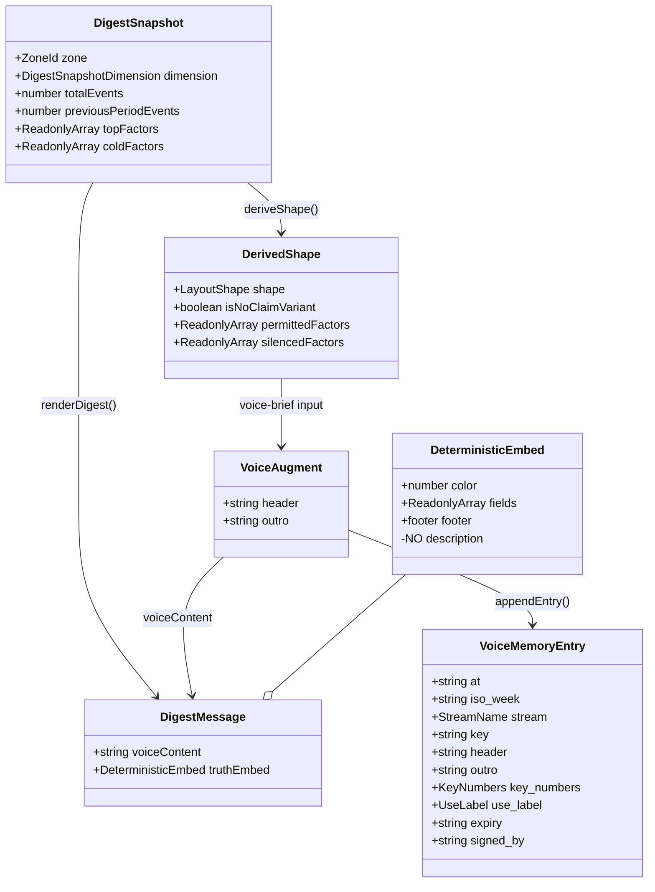
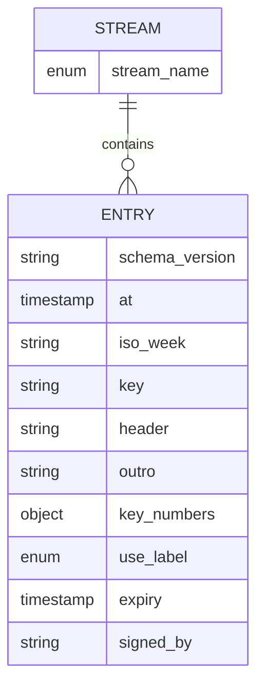
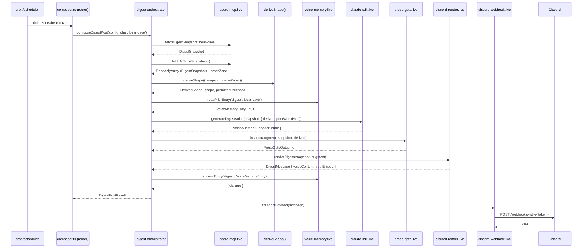

# cycle-006 · substrate-presentation refactor · SDD

> Companion to `grimoires/loa/prd.md`. PRD = WHAT + WHY. SDD = HOW.
> **Cycle**: cycle-006 · substrate-presentation-refactor
> **Date**: 2026-05-16
> **Status**: candidate (post /architect)
> **Predecessor**: cycle-005 SDD at `grimoires/loa/cycles/cycle-005-ruggy-leaderboard/sdd.md` (V1 prose-gate · `inspectProse` digest-only) · PR #81 introduced honeycomb seam (`domain/ports/live/mock/orchestrator`)
> **Branch target**: `feat/cycle-006-substrate-presentation` (cut from main after PR #81 lands or rebased in)

---

## 1. System Overview

cycle-005 + PR #81 introduced the `domain/ports/live/mock/orchestrator` honeycomb for the digest path. BB round 2 verdict on PR #81: REQUEST_CHANGES — three HIGH structural gaps (F-002 shape drift · F-003 two renderers · F-016 voice-memory gallery-only) plus REFRAME (F-014 dual-architecture).

cycle-006 **completes the seam** so that:

1. The substrate-presentation boundary is structurally impossible to violate (type-level + CI-level).
2. Every post type (digest · pop-in · weaver · micro · lore_drop · question · callout · reply) flows through the orchestrator pattern. `composer.ts` becomes a router.
3. Voice-memory is a memory-governance primitive (per-post-type streams · hounfour/straylight-aligned local TypeBox schema · production-wired).
4. A daily-pulse renderer + orchestrator ships, callable from cron when operator wires it.
5. `derive-shape` becomes the single source of truth for `(shape, permittedFactors, silencedFactors)` — both orchestrator dispatch and voice-brief read from it. Property-test pair against the legacy `selectLayoutShape` proves equivalence.
6. The legacy `buildPulseDimensionPayload` renderer is deleted entirely (no shim).

```mermaid
flowchart TB
  subgraph Cron[cron/scheduler.ts]
    DT[digest tick] & PT[pop-in tick] & WT[weaver tick] & CT[callout tick] & PUT[pulse tick]
  end

  subgraph Interactions[apps/bot/discord-interactions]
    ST[slash-command /ruggy /satoshi]
  end

  DT --> CR[composer.ts<br/>thin router]
  PT --> CR
  WT --> CR
  CT --> CR
  PUT --> PO[pulse-orchestrator]
  ST --> CRP[chat-reply-orchestrator]

  CR --> DO[digest-orchestrator]
  CR --> PIO[pop-in-orchestrator]
  CR --> WO[weaver-orchestrator]
  CR --> MO[micro-orchestrator]
  CR --> LO[lore-drop-orchestrator]
  CR --> QO[question-orchestrator]
  CR --> CO[callout-orchestrator]

  subgraph Orchs[orchestrators · src/orchestrator/]
    DO & PIO & WO & MO & LO & QO & CO & CRP & PO
  end

  Orchs --> SP((ScoreFetchPort))
  Orchs --> VP((VoiceGenPort))
  Orchs --> PP((PresentationPort))
  Orchs --> VM((VoiceMemoryPort))
  Orchs --> DP((DeliverPort))

  SP -.live.-> SCL[score-mcp.live.ts]
  SP -.mock.-> SCM[score-mcp.mock.ts]
  VP -.live.-> CSL[claude-sdk.live.ts]
  VP -.mock.-> CSM[claude-sdk.mock.ts]
  PP -.live.-> DRL[discord-render.live.ts<br/>SOLE RENDERER]
  VM -.live.-> VML[voice-memory.live.ts]
  VM -.mock.-> VMM[voice-memory.mock.ts]
  DP -.live.-> WHL[discord-webhook.live.ts]

  DRL --> DM[DigestMessage<br/>voiceContent + truthEmbed]
  DM --> DP
```



**Key seam invariants** (enforced at type level + by `scripts/audit-substrate-presentation-seam.sh`):

- `live/discord-render.live.ts` must NOT import `live/claude-sdk.live.ts`, `compose/agent-gateway.ts`, or anything from `compose/voice-brief.ts`. Voice cannot leak into the presentation file.
- `domain/digest-message.ts::DeterministicEmbed` has NO `description` field. Adding one is a compile error (CI `@ts-expect-error` test pins this).
- Every orchestrator returns a domain message type (`DigestMessage` · `ChatReplyMessage` · `MicroMessage` · etc.); medium-coupling happens ONLY in the `discord-webhook.live.ts` mapper.

### V1 routing invariant (preserved from cycle-005)

cycle-005's hybrid-staged contract is preserved: the prose-gate (`inspectProse`) runs on the DIGEST PATH ONLY. The chat-reply orchestrator wires the gate port but binds it to a no-op adapter (`createNullProseGate()`). Promotion to chat-mode is V1.5 destination per cycle-005 PRD Accepted V1 Limitations A2 — cycle-007+.

---

## 2. Software Stack

All version pins are unchanged from cycle-005 / PR #81 unless noted. cycle-006 is structural — no new runtime dependencies.

| layer | choice | version | rationale |
|---|---|---|---|
| runtime | Bun | ≥1.1 | Existing. ESM-native, fast TS execution, no transpile step. |
| language | TypeScript | 5.x (strict) | Type-level enforcement of substrate-presentation seam (NFR-1) requires strict mode. |
| schema | TypeBox | 0.32.x (already in deps via `loa-hounfour` consumption) | Local schemas mirror hounfour conventions (NFR-3) without upstream PR (per ES/operator governance directive 2026-05-15). Single source of validators on read + write. |
| LLM | `@anthropic-ai/claude-agent-sdk` | unchanged | `claude-sdk.live.ts` continues to be the sole adapter. |
| Discord write | `discord.js` Gateway (Pattern B shell) + per-character webhook overrides | unchanged | webhook delivery wraps `DigestPayload`. |
| Discord read | `Bun.serve` HTTP endpoint at `/webhooks/discord` (Ed25519-verified slash commands) | unchanged | chat-reply orchestrator is the entry point on interaction receipt. |
| cron | `node-cron` | unchanged | three concurrent cadences. cycle-006 adds NO new cron cadences (pulse cron-wire is operator-attested per FR-7). |
| observability | `@effect/opentelemetry` | unchanged from cycle-005 S5 | preserves `chat.invoke` span tree + `voice.shape` + `voice.permitted_count` attributes. cycle-006 adds `voice_memory.read` + `voice_memory.write` events. |
| testing | Bun's built-in test runner + property-tests via `fast-check` | unchanged | property-test pair (NFR-2) uses `fast-check` for 100+ generated `DigestSnapshot` inputs. |
| CI grep / static checks | bash scripts in `scripts/` | new: `scripts/audit-substrate-presentation-seam.sh` | grep-based forbidden-import check + `buildPulseDimensionPayload` deletion-guard. |

### Files added (estimate)

- `packages/persona-engine/src/domain/derive-shape.ts` (new · ~80 LoC)
- `packages/persona-engine/src/domain/voice-memory-entry.ts` (new · ~60 LoC · TypeBox schema)
- `packages/persona-engine/src/domain/{chat-reply,micro,lore-drop,question,callout,weaver,pop-in}-message.ts` (7 files · ~30 LoC each · domain types per post type)
- `packages/persona-engine/src/ports/voice-memory.port.ts` (new · ~25 LoC)
- `packages/persona-engine/src/ports/prose-gate.port.ts` (new · ~30 LoC · wraps existing `inspectProse` for orchestrator injection)
- `packages/persona-engine/src/live/voice-memory.live.ts` (new · ~120 LoC · JSONL adapter)
- `packages/persona-engine/src/mock/voice-memory.mock.ts` (new · ~80 LoC · in-memory adapter with `appendCalls`, `readCalls` introspection)
- `packages/persona-engine/src/orchestrator/{chat-reply,pop-in,weaver,micro,lore-drop,question,callout}-orchestrator.ts` (7 files · ~120-300 LoC each · chat-reply is the largest at ~300)
- `scripts/audit-substrate-presentation-seam.sh` (new · ~50 LoC)
- Test files paired with each new module.

### Files deleted

- `packages/persona-engine/src/deliver/embed.ts::buildPulseDimensionPayload` (and its dimension-specific helpers · ~200 LoC removed)
- `packages/persona-engine/src/deliver/embed-pulse-dimension.test.ts` (replaced by `discord-render.live.test.ts` coverage)
- `packages/persona-engine/src/compose/digest.ts` callers of `buildPulseDimensionPayload` (migration into orchestrator)
- Inline shape-derivation in `live/claude-sdk.live.ts` lines 30-46 (replaced by `domain/derive-shape.ts`)

---

## 3. Component Specs

### 3.1 `domain/digest-message.ts` (already exists · pins the seam)

```typescript
export interface DeterministicEmbed {
  readonly color: number;
  readonly fields: ReadonlyArray<{ name: string; value: string; inline?: boolean }>;
  readonly footer?: { text: string };
  // `description` intentionally absent. Truth zone cannot carry voice.
  // Future cycles may introduce an explicit `AugmentedEmbed` with operator sign-off.
}

export interface DigestMessage {
  readonly voiceContent: string;        // voice surface · message.content
  readonly truthEmbed: DeterministicEmbed;  // substrate surface · message.embeds[0]
}
```

A new file `domain/digest-message.compile-test.ts` pins the constraint:

```typescript
import type { DeterministicEmbed } from './digest-message.ts';

// @ts-expect-error · DeterministicEmbed must NOT accept `description`.
const _violatesSeam: DeterministicEmbed = {
  color: 0,
  fields: [],
  description: 'voice text smuggled into truth zone',
};
```

### 3.2 `domain/derive-shape.ts` (NEW — closes BB F-002 · FR-2 · BB design-review F-001 closure)

Single utility that produces `(shape, permittedFactors, silencedFactors)` from a `DigestSnapshot` + cross-zone context. **BB design-review F-001 closure**: `deriveShape` is the **CANONICAL** shape derivation; the legacy `selectLayoutShape` is **DELETED** (or reduced to a thin re-export of `deriveShape` for backwards-compat during S1 transition). The cycle-005 two-clocks anti-pattern that BB flagged is closed — single source forever.

```typescript
import type { ZoneId, FactorStats } from '../score/types.ts';
import type { DigestSnapshot, DigestFactorSnapshot } from './digest-snapshot.ts';
import type { ProseGateValidation } from '../deliver/prose-gate.ts';

export type LayoutShape = 'A-all-quiet' | 'B-one-dim-hot' | 'C-multi-dim-hot';

export interface PermittedFactor {
  readonly displayName: string;
  readonly stats: FactorStats;
}

export interface SilencedFactor {
  readonly displayName: string;
  readonly reason: ProseGateValidation['violations'][number]['reason'];
}

export interface DerivedShape {
  readonly shape: LayoutShape;
  readonly isNoClaimVariant: boolean;
  readonly permittedFactors: ReadonlyArray<PermittedFactor>;
  readonly silencedFactors: ReadonlyArray<SilencedFactor>;
}

export interface DeriveShapeInput {
  readonly snapshot: DigestSnapshot;
  /**
   * REQUIRED multi-zone context for shape C resolution (BB design-review
   * F-006 closure). Single-zone callers must pass `crossZone: [snapshot]`
   * explicitly. Making this required prevents the silent-divergence path
   * where single-zone deriveShape can never return `C-multi-dim-hot`.
   */
  readonly crossZone: ReadonlyArray<DigestSnapshot>;
  /** Optional pre-computed prose-gate output (when orchestrator already ran it). */
  readonly proseGate?: ProseGateValidation;
}

export function deriveShape(input: DeriveShapeInput): DerivedShape;
```

**Permittedness gate**: `factor.factorStats.magnitude.current_percentile_rank >= 90` AND `factor.factorStats.magnitude.percentiles.p95.reliable === true`.

**Silenced factors**: any factor whose name appears in `proseGate.violations[].proximity_factors` AND whose mechanical permission check failed.

**Property-test** (`domain/derive-shape.test.ts`): runs 100+ `fast-check`-generated multi-zone snapshot arrays and asserts `deriveShape({snapshot, crossZone}).shape` matches a **hand-crafted PRD-derived oracle** (NOT a parallel implementation · per BB design-review F-001). The oracle is documented in `domain/derive-shape-oracle.md`. Any divergence between `deriveShape` and the oracle is a build failure.

**Legacy `selectLayoutShape` deletion** (S1 task): `compose/layout-shape.ts::selectLayoutShape` either (a) deleted, callers migrated to `deriveShape`, OR (b) reduced to a single-line wrapper that throws a deprecation warning + calls `deriveShape`. Option (a) is preferred; (b) is the fallback if grep finds non-orchestrator callers during S1.

### 3.3 `live/discord-render.live.ts` (extended — closes BB F-003 · FR-3)

Already the canonical renderer (`renderDigest` + `renderActivityPulse`). cycle-006 adds:

- `renderChatReply(content: string): ChatReplyMessage`
- `renderMicro(...): MicroMessage`
- `renderWeaver(...): WeaverMessage`
- `renderCallout(...): CalloutMessage`
- `renderLoreDrop(...): LoreDropMessage`
- `renderQuestion(...): QuestionMessage`
- `renderPopIn(...): PopInMessage`

All renderers return domain message types with the `voiceContent + truthEmbed` (or `voiceContent + truthFields` for embed-less types) split.

**Deleted in this cycle**: `deliver/embed.ts::buildPulseDimensionPayload` + dimension-card helpers + `compose/digest.ts::composeDigestForZone` (the legacy synchronous path).

**Renderer constraints** (CI-enforced via `audit-substrate-presentation-seam.sh`):

```bash
# Forbidden imports in live/discord-render.live.ts
grep -E "from '.*compose/(agent-gateway|voice-brief|reply)\b" packages/persona-engine/src/live/discord-render.live.ts && exit 1
grep -E "from '.*live/claude-sdk\b" packages/persona-engine/src/live/discord-render.live.ts && exit 1
# Forbidden: buildPulseDimensionPayload appears anywhere
git grep -n "buildPulseDimensionPayload" -- 'packages/persona-engine/src/' && exit 1
exit 0
```

### 3.4 `live/discord-webhook.live.ts` (extended)

Currently maps `DigestMessage → DigestPayload`. cycle-006 extends with mappers for each new domain message type:

```typescript
export function toDigestPayload(m: DigestMessage): DigestPayload { /* exists */ }
export function toChatReplyPayload(m: ChatReplyMessage): ChatReplyPayload;
export function toMicroPayload(m: MicroMessage): DigestPayload;
export function toWeaverPayload(m: WeaverMessage): DigestPayload;
// ... etc
```

This file is the SOLE point where domain types couple to the Discord wire format. Any future medium (CLI · Telegram) adds its own `*.live.ts` adapter file consuming the same domain types.

### 3.5 `ports/voice-memory.port.ts` (NEW — FR-4 · FR-5)

```typescript
import type { VoiceMemoryEntry } from '../domain/voice-memory-entry.ts';

export type StreamName =
  | 'digest'
  | 'chat-reply'
  | 'pop-in'
  | 'weaver'
  | 'micro'
  | 'lore_drop'
  | 'question'
  | 'callout';

export interface VoiceMemoryPort {
  /** Read the most recent entry for (stream, key). Returns null if absent. */
  readonly readPriorEntry: (
    stream: StreamName,
    key: string,
  ) => Promise<VoiceMemoryEntry | null>;
  /** Read the last N entries for (stream, key), newest-first. */
  readonly readRecent: (
    stream: StreamName,
    key: string,
    limit: number,
  ) => Promise<ReadonlyArray<VoiceMemoryEntry>>;
  /** Append an entry. Best-effort: errors caught and surfaced via `VoiceMemoryWriteResult`. */
  readonly appendEntry: (
    stream: StreamName,
    entry: VoiceMemoryEntry,
  ) => Promise<VoiceMemoryWriteResult>;
}

export type VoiceMemoryWriteResult =
  | { readonly ok: true }
  | { readonly ok: false; readonly reason: string };
```

**Key convention** (avoids cross-stream collision):

| stream | key shape | example |
|---|---|---|
| `digest` | `<zoneId>` | `bear-cave` |
| `chat-reply` | `<channelId>` | `1234567890123456789` |
| `pop-in` | `<zoneId>` | `el-dorado` |
| `weaver` | `cross-zone` | `cross-zone` (singleton) |
| `micro` / `lore_drop` / `question` | `<zoneId>` | `owsley-lab` |
| `callout` | `<zoneId>:<triggerId>` | `bear-cave:rank-jump-21` |

**Key derivation factory** (BB design-review F-009 closure): keys are constructed by typed factory functions in `domain/voice-memory-keys.ts` rather than inline string-construction at orchestrator call sites. If chat-reply's key shape needs to change (OQ-1: `channelId` vs `channelId:userId`), the change is single-site:

```typescript
// domain/voice-memory-keys.ts
export const keyForDigest = (zone: ZoneId): string => zone;
export const keyForChatReply = (channelId: string): string => channelId;
export const keyForPopIn = (zone: ZoneId): string => zone;
export const keyForWeaver = (): string => 'cross-zone';
export const keyForMicro = (zone: ZoneId): string => zone;
export const keyForLoreDrop = (zone: ZoneId): string => zone;
export const keyForQuestion = (zone: ZoneId): string => zone;
export const keyForCallout = (zone: ZoneId, triggerId: string): string => `${zone}:${triggerId}`;
```

Orchestrators import the factory; never construct keys inline.

### 3.6 `domain/voice-memory-entry.ts` (NEW — TypeBox · NFR-3)

```typescript
import { Type, type Static } from '@sinclair/typebox';

export const StreamNameSchema = Type.Union([
  Type.Literal('digest'),
  Type.Literal('chat-reply'),
  Type.Literal('pop-in'),
  Type.Literal('weaver'),
  Type.Literal('micro'),
  Type.Literal('lore_drop'),
  Type.Literal('question'),
  Type.Literal('callout'),
]);

export const UseLabelSchema = Type.Union([
  Type.Literal('usable'),
  Type.Literal('background_only'),
  Type.Literal('mark_as_contested'),
  Type.Literal('do_not_use_for_action'),
]);

export const VoiceMemoryEntrySchema = Type.Object({
  /**
   * Forward-compat pattern (BB design-review F-008): accept any '1.x.x'.
   * Additive field evolution (new optional fields) within v1 is allowed
   * without breaking existing readers. Major version bumps reset compat.
   */
  schema_version: Type.String({ pattern: '^1\\.[0-9]+\\.[0-9]+$' }),
  at: Type.String({ format: 'date-time' }),
  iso_week: Type.Optional(Type.String({ pattern: '^\\d{4}-W\\d{2}$' })),
  stream: StreamNameSchema,
  zone: Type.Optional(Type.String()),
  key: Type.String({ minLength: 1, maxLength: 64 }),

  /**
   * Voice surface. maxLength enforces a per-entry size budget that keeps
   * the serialized JSONL line under PIPE_BUF on macOS (512 bytes) when
   * paired with the other fields. BB design-review F-004 closure: ensures
   * `appendFile` atomicity for concurrent writes on the same stream/key
   * (one O_APPEND write per entry · fits in a single atomic syscall).
   */
  header: Type.String({ maxLength: 280 }),
  outro: Type.String({ maxLength: 280 }),

  // Substrate values the voice referenced — for cross-week diff
  key_numbers: Type.Object({
    total_events: Type.Number(),
    previous_period_events: Type.Optional(Type.Number()),
    permitted_factor_names: Type.Array(Type.String()),
  }),

  /**
   * Straylight-aligned governance fields.
   *
   * BB design-review F-011 evolution path: these are INERT in V1 (written
   * on append, read but not acted upon). A future cycle (007+) MAY make
   * them runtime filters — entries with `use_label: 'do_not_use_for_action'`
   * skipped on read, `mark_as_contested` carries a warning flag into
   * voice-brief. This would be the first concrete instance of Straylight
   * memory-governance enforcement in the codebase. Document the evolution
   * path here so future cycles see the hook; do not build it in cycle-006.
   */
  use_label: UseLabelSchema,
  expiry: Type.String({ format: 'date-time' }),
  signed_by: Type.String({ default: 'agent:claude' }),
});

export type VoiceMemoryEntry = Static<typeof VoiceMemoryEntrySchema>;
```

Validation runs on BOTH read and write paths (`voice-memory.live.ts` runs TypeBox `Value.Check()` and `Value.Errors()`). Malformed lines are skipped on read; rejected entries on write surface as `{ ok: false, reason: '...' }`.

### 3.7 `live/voice-memory.live.ts` (NEW — FR-4 · FR-5)

```typescript
import { appendFile, readFile, mkdir } from 'node:fs/promises';
import { dirname, resolve } from 'node:path';
import { existsSync } from 'node:fs';
import { Value } from '@sinclair/typebox/value';
import type { VoiceMemoryPort, StreamName, VoiceMemoryWriteResult } from '../ports/voice-memory.port.ts';
import { VoiceMemoryEntrySchema, type VoiceMemoryEntry } from '../domain/voice-memory-entry.ts';

const DEFAULT_BASE = '.run/voice-memory';

export interface VoiceMemoryLiveOpts {
  readonly basePath?: string;
  readonly clock?: () => Date;
}

export function createVoiceMemoryLive(opts: VoiceMemoryLiveOpts = {}): VoiceMemoryPort {
  const base = opts.basePath ?? process.env.VOICE_MEMORY_BASE_PATH ?? DEFAULT_BASE;

  /**
   * BB design-review F-004 + Flatline SKP-001/850 + SKP-002/740 closure.
   *
   * Per-key mutex for concurrent-write safety: serializes same-key writes
   * through a promise chain. Belt-and-suspenders with TypeBox maxLength
   * 280 on header/outro (ensures serialized line under macOS PIPE_BUF).
   *
   * **Cleanup correctness (Flatline SKP-001/850 closure)**: previous
   * naive `===` check against `next.then(...)` would NEVER match (creates
   * a new promise) — Map would grow monotonically for the lifetime of
   * the process. Bot is long-running cron; callout keys (`zone:triggerId`)
   * can grow unbounded. Fix: store the actual chain handle as the Map
   * value and compare by reference in the cleanup hook.
   */
  interface LockChain { readonly chain: Promise<void>; }
  const keyLocks = new Map<string, LockChain>();
  const lockKeyFor = (stream: StreamName, key: string): string => `${stream}:${key}`;

  function pathFor(stream: StreamName, key: string): string {
    // SAFETY: validate key matches `[A-Za-z0-9._:-]+` to prevent path escape
    if (!/^[A-Za-z0-9._:-]+$/.test(key)) {
      throw new Error(`voice-memory: invalid key shape (${key})`);
    }
    return resolve(base, stream, `${key}.jsonl`);
  }

  return {
    async readPriorEntry(stream, key) {
      const entries = await this.readRecent(stream, key, 1);
      return entries[0] ?? null;
    },

    async readRecent(stream, key, limit) {
      const path = pathFor(stream, key);
      if (!existsSync(path)) return [];
      const text = await readFile(path, 'utf8');
      const lines = text.split('\n').filter((l) => l.trim().length > 0);
      const recent = lines.slice(-Math.max(1, limit * 4));  // 4× buffer for malformed
      const out: VoiceMemoryEntry[] = [];
      for (let i = recent.length - 1; i >= 0 && out.length < limit; i--) {
        try {
          const parsed = JSON.parse(recent[i]!);
          if (Value.Check(VoiceMemoryEntrySchema, parsed)) {
            out.push(parsed);
          }
        } catch { /* skip malformed line */ }
      }
      return out;
    },

    async readRecent(stream, key, limit) {
      // Flatline SKP-003 closure · fs errors must not propagate
      const path = pathFor(stream, key);
      if (!existsSync(path)) return [];
      let text: string;
      try {
        text = await readFile(path, 'utf8');
      } catch {
        return [];  // EACCES / EISDIR / other fs errors → empty as if absent
      }
      const lines = text.split('\n').filter((l) => l.trim().length > 0);
      const recent = lines.slice(-Math.max(1, limit * 4));
      const out: VoiceMemoryEntry[] = [];
      for (let i = recent.length - 1; i >= 0 && out.length < limit; i--) {
        try {
          const parsed = JSON.parse(recent[i]!);
          if (Value.Check(VoiceMemoryEntrySchema, parsed)) out.push(parsed);
        } catch { /* skip malformed line */ }
      }
      return out;
    },

    async appendEntry(stream, entry): Promise<VoiceMemoryWriteResult> {
      if (!Value.Check(VoiceMemoryEntrySchema, entry)) {
        const errs = [...Value.Errors(VoiceMemoryEntrySchema, entry)];
        return { ok: false, reason: `schema: ${errs[0]?.message ?? 'unknown'}` };
      }
      const path = pathFor(stream, entry.key);
      // Per-key mutex: serialize concurrent writes on same (stream, key).
      // Cleanup correctness fix (Flatline SKP-001/850) — compare by stored handle.
      const lockKey = lockKeyFor(stream, entry.key);
      const prevChain = keyLocks.get(lockKey)?.chain ?? Promise.resolve();
      let release!: () => void;
      const next = new Promise<void>((resolve) => { release = resolve; });
      const myChain: LockChain = { chain: prevChain.then(() => next) };
      keyLocks.set(lockKey, myChain);
      await prevChain;
      try {
        const dir = dirname(path);
        if (!existsSync(dir)) await mkdir(dir, { recursive: true });
        await appendFile(path, JSON.stringify(entry) + '\n', 'utf8');
        return { ok: true };
      } catch (err) {
        return { ok: false, reason: (err as Error).message };
      } finally {
        release();
        // Cleanup: only delete if THIS chain is still the tail of the lock.
        // If another writer queued during our work, they replaced the Map
        // value — don't delete (would orphan their await).
        if (keyLocks.get(lockKey) === myChain) {
          keyLocks.delete(lockKey);
        }
      }
    },
  };
}
```

**Storage layout** (per FR-5):

```
.run/voice-memory/
  digest/
    bear-cave.jsonl
    el-dorado.jsonl
    owsley-lab.jsonl
    stonehenge.jsonl
  chat-reply/
    <channelId>.jsonl   (one per channel)
  pop-in/
    <zoneId>.jsonl
  weaver/
    cross-zone.jsonl
  micro/, lore_drop/, question/, callout/
    <zoneId>.jsonl  (or <zoneId>:<triggerId>.jsonl for callout)
```

Append-only JSONL. Bounded informally by NFR-4 retention (last N entries · last 4 entries for digest, last 5 messages for chat-reply, last 3 for others). Pruning cron deferred to cycle-007+ (A4).

### 3.8 `mock/voice-memory.mock.ts` (NEW — NFR-2)

```typescript
export interface VoiceMemoryMockInspection {
  readonly appendCalls: ReadonlyArray<{ stream: StreamName; entry: VoiceMemoryEntry }>;
  readonly readCalls: ReadonlyArray<{ stream: StreamName; key: string }>;
}

export interface VoiceMemoryMock extends VoiceMemoryPort, VoiceMemoryMockInspection {
  readonly seed: (entries: Map<string, VoiceMemoryEntry[]>) => void;
}

export function createVoiceMemoryMock(): VoiceMemoryMock;
```

In-memory `Map<string, VoiceMemoryEntry[]>` keyed by `${stream}:${key}`. Records every call for introspection. Tests use `createVoiceMemoryMock()` to seed prior-week entries and assert that orchestrators call `appendEntry` after voice-gen.

### 3.9 `orchestrator/digest-orchestrator.ts` (EXTENDED — closes BB F-016)

Adds voice-memory read + write around the existing flow:

```typescript
export interface DigestOrchestratorDeps {
  readonly score?: ScoreFetchPort;
  readonly voice?: VoiceGenPort;
  readonly presentation?: PresentationPort;
  readonly voiceMemory?: VoiceMemoryPort;  // NEW
  readonly proseGate?: ProseGatePort;       // NEW
  readonly clock?: () => Date;              // NEW · injectable for tests
}

export async function composeDigestPost(
  config: Config,
  character: CharacterConfig,
  zone: ZoneId,
  deps: DigestOrchestratorDeps = {},
): Promise<DigestPostResult> {
  const score = deps.score ?? createScoreMcpLive(config);
  const voiceGen = deps.voice ?? createClaudeSdkLive(config, character);
  const renderer = deps.presentation ?? presentation;
  const memory = deps.voiceMemory ?? createVoiceMemoryLive();
  const gate = deps.proseGate ?? createProseGateLive();
  const clock = deps.clock ?? (() => new Date());
  const keys = await import('../domain/voice-memory-keys.ts');

  // 1. Substrate fetch · ALL zones for cross-zone shape resolution
  //    (Flatline SDD SKP-001/860 closure · crossZone is REQUIRED)
  const snapshot = await score.fetchDigestSnapshot(zone);
  const allZones = await score.fetchAllZoneSnapshots();  // multi-zone context

  // 2. Shape derivation · SINGLE SOURCE (FR-2)
  //    crossZone passed explicitly (Flatline SKP-001/860 closure)
  const derived = deriveShape({ snapshot, crossZone: allZones });

  // 3. Voice-memory READ (FR-4 · F-016) · wrapped for fail-safe
  //    (Flatline SKP-003 closure · fs errors must not block the post)
  let priorWeekHint: string | undefined;
  try {
    const prior = await memory.readPriorEntry('digest', keys.keyForDigest(zone));
    priorWeekHint = prior ? formatPriorWeekHint(prior) : undefined;
  } catch (err) {
    // log + continue · post matters more than memory
    rootSpan.addEvent('voice_memory.read.error', { stream: 'digest', error: (err as Error).message });
  }

  // 4. Voice generation
  const augment = config.VOICE_DISABLED
    ? undefined
    : await voiceGen.generateDigestVoice(snapshot, {
        derived,
        priorWeekHint,
      });

  // 5. Prose-gate inspection (V1 routing invariant · digest-only)
  const gateOutcome = augment
    ? gate.inspect(augment, snapshot, derived)
    : { matched_patterns: [], violations: [], mode: 'log' as const };

  // 6. Apply gate fail-safe (Flatline SKP-002/750 closure · gateOutcome must be CONSUMED)
  //    silence-mode + HIGH violations → force shape A · drop augment from render.
  //    See cycle-005 SDD §1 ProseGateOutcome.shape_override mapping.
  const effectiveDerived: DerivedShape =
    gateOutcome.mode === 'silence' &&
    gateOutcome.violations.some((v) => v.reason !== 'no-factor-context')
      ? { ...derived, shape: 'A-all-quiet', isNoClaimVariant: true }
      : derived;
  const effectiveAugment = effectiveDerived.shape === 'A-all-quiet' && gateOutcome.mode === 'silence'
    ? undefined  // silence-mode strips voice entirely
    : augment;

  // 7. Render with effective shape + augment
  const message = renderer.renderDigest(snapshot, effectiveAugment, effectiveDerived);

  // 8. Voice-memory WRITE (FR-4 · F-016)
  //    Sanitize header/outro before persist (Flatline SKP-004 closure ·
  //    strip control bytes + NFKC normalize)
  if (effectiveAugment) {
    const sanitized = {
      header: sanitizeMemoryText(effectiveAugment.header),
      outro: sanitizeMemoryText(effectiveAugment.outro),
    };
    const writeResult = await memory.appendEntry('digest', {
      schema_version: '1.0.0',
      at: clock().toISOString(),
      iso_week: isoWeek(clock()),
      stream: 'digest',
      key: keys.keyForDigest(zone),
      zone,
      header: sanitized.header,
      outro: sanitized.outro,
      key_numbers: {
        total_events: snapshot.totalEvents,
        previous_period_events: snapshot.previousPeriodEvents,
        permitted_factor_names: derived.permittedFactors.map((f) => f.displayName),
      },
      use_label: 'usable',
      expiry: addWeeks(clock(), 4).toISOString(),  // 4-week retention
      signed_by: 'agent:claude',
    });
    if (!writeResult.ok) {
      rootSpan.addEvent('voice_memory.write.error', { stream: 'digest', reason: writeResult.reason });
    }
  }

  return { zone, postType: 'digest', digest: snapshotToZoneDigest(snapshot), voice: '...', payload: toDigestPayload(message) };
}
```

**`sanitizeMemoryText` helper** (Flatline SKP-004 closure · strip control bytes + NFKC normalize):

```typescript
// domain/voice-memory-sanitize.ts
export function sanitizeMemoryText(text: string): string {
  if (!text) return '';
  // Strip C0/C1 control bytes (preserve \n if needed — voice surface is single-line)
  const stripped = text.replace(/[\x00-\x09\x0B-\x1F\x7F-\x9F]/g, '');
  // NFKC normalize (defends against unicode visual confusion · cycle-098 L7 pattern)
  const normalized = stripped.normalize('NFKC');
  // Strip Cf-category zero-width chars
  return normalized.replace(/[​-‍]/g, '').trim();
}
```

Note: full cycle-098 L6/L7 `<untrusted-content>` wrapping at SURFACING is NOT in cycle-006 scope (would require importing L6/L7 substrate). Stripping at WRITE provides the immediate defense; future cycle can add the surfacing-time wrap if the voice-memory `priorWeekHint` ever needs L6/L7 treatment.
```

### 3.10 `orchestrator/chat-reply-orchestrator.ts` (NEW — FR-6 · BB design-review F-002 closure)

Replaces the core of `compose/reply.ts::composeReplyWithEnrichment`. The interaction-dispatch entry point in `apps/bot/src/discord-interactions/dispatch.ts` calls this directly.

**BB design-review F-002 closure**: chat-reply-orchestrator **does NOT import or wire `ProseGatePort`**. The V1 routing invariant ("prose-gate is digest-only") becomes structural via file boundary, not configurable via null-adapter. When V1.5 promotion happens, it's a real architecture change (import + wire the port), not a config flip. No plumbing-for-future-ergonomic.

```typescript
export interface ChatReplyOrchestratorDeps {
  readonly score?: ScoreFetchPort;
  readonly voice?: ChatReplyVoiceGenPort;
  readonly presentation?: PresentationPort;
  readonly voiceMemory?: VoiceMemoryPort;
  // INTENTIONALLY NO proseGate field · V1 invariant is structural (cycle-005)
  readonly transforms?: ChatReplyTransformsPort;  // emoji-translate · grail-ref-guard · strip-voice-drift
}

export async function composeChatReply(
  config: Config,
  character: CharacterConfig,
  args: { channelId: string; userId: string; prompt: string },
  deps: ChatReplyOrchestratorDeps = {},
): Promise<ChatReplyResult>;
```

**Preserved transforms** (from `compose/reply.ts`):
- `translateEmojiShortcodes` → `transforms.translateEmoji(text)` port
- `stripVoiceDisciplineDrift` → `transforms.stripVoiceDrift(text, opts)` port
- `inspectGrailRefs` → `transforms.guardGrailRefs(text)` port
- `composeWithImage` (codex grail attach) → `transforms.composeWithImage(payload)` port

Each transform becomes a port + live adapter + mock. Tests inject mocks to verify transform sequence + arguments.

**V1 routing invariant preserved STRUCTURALLY** (BB design-review F-002): this orchestrator does NOT import `prose-gate.port.ts` or any prose-gate-related module. Cycle-005 doctrine + cycle-006 BB design-review concur: a port wired only to bind a null adapter is plumbing-for-future-ergonomic. The honest expression of "V1 doesn't run prose-gate on chat-reply" is to not import it at all. V1.5 promotion becomes a real architecture edit (one file · import + DI hook), not a config flip.

### 3.11 `orchestrator/{pop-in,weaver,micro,lore-drop,question,callout}-orchestrator.ts` (NEW — FR-6)

Each follows the same shape · `crossZone` REQUIRED in `deriveShape` calls per Flatline SKP-001/860:

```typescript
export async function compose<PostType>Post(
  config: Config,
  character: CharacterConfig,
  zone: ZoneId,
  deps: <PostType>OrchestratorDeps = {},
): Promise<<PostType>PostResult> {
  // 1. fetch (post-type specific) + multi-zone snapshot if shape-aware
  const snapshot = await score.fetch<PostType>(zone);
  const allZones = await score.fetchAllZoneSnapshots();  // required for deriveShape
  // 2. fitness check (popInFits / calloutFits / etc.)
  // 3. shape derivation (when post type needs it · pop-in/callout may bypass)
  const derived = deriveShape({ snapshot, crossZone: allZones });
  // 4. voice-memory read (try/catch wrapped · per-post-type stream)
  // 5. voice-gen (with priorEntryHint + derived)
  // 6. render (via PresentationPort.render<PostType>)
  // 7. voice-memory write (sanitized text · per-key mutex serializes)
}
```

The `composer.ts::composeZonePost` router becomes (BB design-review F-007 closure · type-level rejection of `'reply'` instead of runtime throw):

```typescript
import type { PostType } from './post-types.ts';

/**
 * BB design-review F-007: 'reply' is not zone-routed. Express this in the
 * TYPE rather than throwing at runtime. The compiler rejects misuse at
 * the call site.
 */
export type ZoneRoutedPostType = Exclude<PostType, 'reply'>;

const MIGRATED_POST_TYPES: ReadonlySet<ZoneRoutedPostType> = new Set([
  'digest', 'micro', 'weaver', 'lore_drop', 'question', 'callout', 'pop-in',
]);

export async function composeZonePost(
  config: Config,
  character: CharacterConfig,
  zone: ZoneId,
  postType: ZoneRoutedPostType = 'digest',  // NOT PostType · type-level rejection of 'reply'
  opts: ComposeZonePostOpts = {},
): Promise<PostComposeResult | null> {
  switch (postType) {
    case 'digest':    return composeDigestPost(config, character, zone);
    case 'micro':     return composeMicroPost(config, character, zone);
    case 'weaver':    return composeWeaverPost(config, character, zone);
    case 'lore_drop': return composeLoreDropPost(config, character, zone);
    case 'question':  return composeQuestionPost(config, character, zone);
    case 'callout':   return composeCalloutPost(config, character, zone);
    case 'pop-in':    return composePopInPost(config, character, zone);
  }
}
```

Chat-reply callers must use `composeChatReply` directly from `chat-reply-orchestrator.ts` (interaction-dispatch path · NOT zone-routed).

A CI test asserts `for each pt in ALL_POST_TYPES (except 'reply'): MIGRATED_POST_TYPES.has(pt)` by cycle close. The transitional dual-architecture exists ONLY during sprints S3-S4 while individual orchestrators land.

### 3.12 `live/claude-sdk.live.ts` (REFACTORED — closes BB F-002)

Inline shape-derivation (lines 30-46) is DELETED. The `generateDigestVoice` port signature is extended to receive pre-derived shape from the orchestrator:

```typescript
export interface VoiceGenPort {
  readonly generateDigestVoice: (
    snapshot: DigestSnapshot,
    ctx: { derived: DerivedShape; priorWeekHint?: string },
  ) => Promise<VoiceAugment>;
}
```

The live adapter now reads `ctx.derived.shape`, `ctx.derived.permittedFactors`, `ctx.derived.silencedFactors` directly. No parallel licensing computation. The `voice.shape` and `voice.permitted_count` OTEL attributes still emit (sourced from `ctx.derived`).

**Critical**: this is where F-002 closes — the orchestrator computes `derived` ONCE and passes the SAME data both to the renderer AND to voice-gen. No drift possible.

### 3.13 `scripts/audit-substrate-presentation-seam.sh` (NEW — NFR-1 · CI-enforced)

```bash
#!/usr/bin/env bash
# cycle-006 NFR-1 · forbidden imports across the substrate-presentation seam.
# Run in CI on every PR. Fails the build on any violation.

set -euo pipefail
ROOT="${1:-packages/persona-engine/src}"
EXIT=0

# Renderer cannot import voice modules.
if grep -lE "from '.*(compose/(agent-gateway|voice-brief|reply)|live/claude-sdk)" \
     "${ROOT}/live/discord-render.live.ts"; then
  echo "FAIL: discord-render.live.ts imports voice module" >&2
  EXIT=1
fi

# buildPulseDimensionPayload must not exist anywhere in src.
if git grep -l "buildPulseDimensionPayload" -- "${ROOT}"; then
  echo "FAIL: buildPulseDimensionPayload still referenced" >&2
  EXIT=1
fi

# DeterministicEmbed must not gain a `description` field.
if grep -E "description\s*[:?]" "${ROOT}/domain/digest-message.ts"; then
  echo "FAIL: DeterministicEmbed contains 'description' field" >&2
  EXIT=1
fi

# composer.ts must not contain post-type business logic (only switch+dispatch).
if grep -cE "buildPostPayload|invoke\(config," "${ROOT}/compose/composer.ts" | \
   awk '{ exit !($1 > 0) }'; then
  echo "FAIL: composer.ts contains business logic; must be router only" >&2
  EXIT=1
fi

exit ${EXIT}
```

Wired into `package.json::scripts::lint:seam` and into the CI workflow (cycle-006 S8 task).

---

## 4. Data Models

### 4.1 Domain types map



### 4.2 Voice-memory file lifecycle

```mermaid
stateDiagram-v2
  [*] --> Absent : fresh install
  Absent --> Empty : first appendEntry mkdirs path
  Empty --> Populated : N entries written
  Populated --> Populated : each cron tick appends 1 entry
  Populated --> Pruned : (cycle-007+) prune cron
  Pruned --> Populated : new entries continue to land
  Populated --> Corrupted : disk error / partial write
  Corrupted --> Populated : malformed lines skipped on read; new writes succeed
```



### 4.3 ER for voice-memory (logical · physical is JSONL)



---

## 5. API Specifications

### 5.1 Port surface (all internal · no HTTP)

| port | file | consumers | mock |
|---|---|---|---|
| `ScoreFetchPort` | `ports/score-fetch.port.ts` | all orchestrators | `mock/score-mcp.mock.ts` (exists) |
| `VoiceGenPort` (digest) | `ports/voice-gen.port.ts` | `digest-orchestrator` | `mock/claude-sdk.mock.ts` (exists, signature evolves with FR-2) |
| `ChatReplyVoiceGenPort` (NEW) | `ports/chat-reply-voice-gen.port.ts` | `chat-reply-orchestrator` | `mock/chat-reply-voice-gen.mock.ts` |
| `PresentationPort` | `ports/presentation.port.ts` | all orchestrators | `mock/presentation.mock.ts` (NEW · for tests that don't need real rendering) |
| `VoiceMemoryPort` (NEW) | `ports/voice-memory.port.ts` | all orchestrators | `mock/voice-memory.mock.ts` |
| `ProseGatePort` (NEW · wraps `inspectProse`) | `ports/prose-gate.port.ts` | digest only (V1) | `mock/prose-gate.mock.ts` (returns no-op in chat-reply) |
| `DeliverPort` | `ports/deliver.port.ts` | all orchestrators (when wiring delivery) | `mock/deliver.mock.ts` |
| `ChatReplyTransformsPort` (NEW) | `ports/chat-reply-transforms.port.ts` | chat-reply-orchestrator | `mock/chat-reply-transforms.mock.ts` |

### 5.2 Existing HTTP/Discord surfaces (unchanged)

- **Discord webhook write**: `discord-webhook.live.ts` continues to be the sole writer. Payload shape per Discord API spec.
- **Discord interactions read**: `Bun.serve` HTTP endpoint at `/webhooks/discord`. Ed25519-verified. `apps/bot/src/discord-interactions/dispatch.ts` reads body → routes to `composeChatReply`.
- **score-mcp consumption**: `score-mcp.live.ts` calls `https://score-api-production.up.railway.app/mcp` over HTTP/SSE. No changes.

### 5.3 Discord payload shape (unchanged · DigestPayload)

```typescript
{
  content: string,           // voice text (Pattern B per-character webhook identity overrides bot name)
  embeds: [{
    color: number,
    fields: [{ name, value, inline? }],
    footer?: { text }
  }]
}
```

The renderer-to-payload mapper in `discord-webhook.live.ts` is the SOLE boundary where domain types meet the Discord wire format.

---

## 6. Error Handling Strategy

### 6.1 Layered fail-safe (preserves the "post matters more than the memory" principle from cycle-005)

| layer | error class | handler |
|---|---|---|
| substrate fetch (score-mcp) | network · timeout · 5xx | propagate (substrate down = no post; existing cycle-005 behavior) |
| voice-gen (claude-sdk) | API error · rate limit · empty response | caught in `claude-sdk.live.ts`; returns `EMPTY_VOICE_AUGMENT` (cycle-005 bug-20260511 fix) |
| voice-memory READ | file missing · malformed JSON · path-escape attempt | return `null` (no priorWeekHint · fresh compose) |
| voice-memory WRITE | disk full · permission denied · schema violation | return `{ ok: false, reason }`; orchestrator logs but post still goes out |
| prose-gate violation (digest only) | env=`silence` + HIGH violations | force shape A via `effectiveDerived` (Flatline SKP-002/750 closure · gateOutcome IS consumed at §3.9 step 6) |
| prose-gate violation (chat-reply) | n/a | chat-reply orchestrator does NOT import prose-gate (Flatline SKP-002/710 + BB F-002 closure · structural invariant) |
| render failure | malformed snapshot · field char-cap overflow | overflow truncates + adds `…and N more silent` token (existing renderer behavior) |
| delivery failure | Discord 4xx/5xx · webhook URL invalid | logged + retried per cycle-005 retry policy (unchanged) |

### 6.2 Type-level error prevention

The whole point of cycle-006: many errors that could happen at runtime are made impossible at compile time.

- "voice text smuggled into truth embed" — impossible because `DeterministicEmbed` has no `description` field.
- "shape derivation mismatch between voice-brief and dispatch" — impossible because `deriveShape()` is called ONCE in the orchestrator and threaded into both surfaces.
- "two divergent renderers" — impossible because `buildPulseDimensionPayload` is deleted; `git grep` is the regression guard.
- "chat-reply accidentally runs prose-gate" — impossible because chat-reply-orchestrator does NOT import prose-gate (BB F-002 + Flatline SKP-002/710 closure · structural invariant via file boundary, not config flip).

### 6.3 OTEL error span attributes

Every orchestrator span tags errors uniformly:

| attribute | values |
|---|---|
| `error.class` | `score.fetch` · `voice.gen` · `voice.memory.read` · `voice.memory.write` · `prose.gate` · `render` · `deliver` |
| `error.recoverable` | `true` (post still goes out) · `false` (post fails) |
| `voice.shape` | from `derived.shape` (always emitted, even on error) |
| `voice.permitted_count` | from `derived.permittedFactors.length` |
| `voice_memory.read` (event) | `{ stream, key, hit: bool }` |
| `voice_memory.write` (event) | `{ stream, key, ok: bool, reason?: string }` |

---

## 7. Testing Strategy

### 7.1 Belt-and-suspenders (NFR-1 + NFR-2)

| layer | test | file | mechanism |
|---|---|---|---|
| compile-time | `DeterministicEmbed` rejects `description` | `domain/digest-message.compile-test.ts` | `@ts-expect-error` annotation |
| compile-time | `live/discord-render.live.ts` forbidden imports | `scripts/audit-substrate-presentation-seam.sh` | grep + git grep |
| compile-time | `composer.ts` is router-only | same script | grep for forbidden patterns |
| property-test | `deriveShape` == `selectLayoutShape` on 100+ snapshots | `domain/derive-shape.test.ts` | `fast-check` |
| runtime contract | digest payload has full substrate data with `voice.calls.length === 0` | `orchestrator/digest-orchestrator.test.ts` | mock with `createClaudeSdkMock({ voiceCalls: 0 })` |
| runtime contract | voice-memory append→read roundtrip is identity | `live/voice-memory.live.test.ts` | tmp dir + real JSONL writes |
| runtime contract | digest writes voice-memory after voice-gen | `orchestrator/digest-orchestrator.test.ts` | `createVoiceMemoryMock` + `expect(mock.appendCalls).toHaveLength(1)` |
| compile-time | chat-reply-orchestrator does NOT import prose-gate (BB F-002 · Flatline SKP-002/710) | `scripts/audit-substrate-presentation-seam.sh` | grep for forbidden import in chat-reply file |
| canary | seeded prior-week memory → 2nd run reads it | `orchestrator/digest-voice-memory.canary.test.ts` | seed mock, run twice, assert priorWeekHint |
| canary | seam audit script exits 0 on clean tree | `scripts/audit-substrate-presentation-seam.test.sh` | `bats`-style check |

### 7.2 Per-orchestrator suite (each new orchestrator)

Each of the 7 new orchestrators ships with a `*-orchestrator.test.ts` that asserts:
1. correct port wire-up (each port called the expected number of times)
2. voice-memory read happens BEFORE voice-gen
3. voice-memory write happens AFTER voice-gen
4. presentation port is called with the correct domain inputs
5. error path: voice-gen failure → empty augment, post still composes
6. error path: voice-memory write failure → logged, post still returns

### 7.3 Property-test pair (closes BB F-002 · NFR-2)

```typescript
import * as fc from 'fast-check';

it('deriveShape agrees with selectLayoutShape on 100+ snapshots', () => {
  fc.assert(fc.property(
    fc.array(fc.record({ /* snapshot generator */ }), { minLength: 1, maxLength: 4 }),
    (snapshots) => {
      const derived = snapshots.map((s) => deriveShape({ snapshot: s }));
      const args = buildSelectLayoutShapeArgs(snapshots);
      const legacy = selectLayoutShape(args);
      // Either all-zone derived agrees with cross-zone legacy
      expect(derived[0].shape).toEqual(legacy);
    },
  ), { numRuns: 100 });
});
```

If divergence is found during S1 implementation, that IS the goal: it surfaces a real semantic drift that must be reconciled before cycle close (per PRD Risk · property-test pair discovers drift).

### 7.4 BB round 3 acceptance

The cycle-006 PR is reviewed by Bridgebuilder. Verdict APPROVED (or PRAISE-only findings) is the merge gate.

Specific BB findings expected to be CLOSED:

| finding | closure mechanism |
|---|---|
| F-002 (shape drift) | `domain/derive-shape.ts` + property-test pair |
| F-003 (two renderers) | `buildPulseDimensionPayload` deleted + git-grep guard |
| F-016 (voice-memory gallery-only) | production digest orchestrator wired + canary test |
| F-014 (dual-architecture) | composer.ts becomes router; 100% migration tracked via CI test |

### 7.5 Test infrastructure

- Bun's built-in test runner (unchanged from cycle-005).
- `fast-check` (already in deps for property tests · used by cycle-005 S0 calibration spike).
- Mock files colocated with port definitions under `mock/`.
- Canary tests live under `orchestrator/*.canary.test.ts` (excluded from main suite, run in CI under `bun test --filter canary`).

### 7.6 Live-adapter integration tests (BB design-review F-005 closure)

Mock-driven tests cover orchestrator wire-up but cannot exercise the live adapter's failure modes (malformed-line skip · path-escape rejection · schema-violation rejection · filesystem errors). The mock uses `Map<string, VoiceMemoryEntry[]>` while live uses JSONL — divergent failure surfaces. Add `live/voice-memory.live.test.ts` that exercises the real adapter against `mkdtempSync`:

| test | mechanism |
|---|---|
| append→read roundtrip is identity | write 3 entries, read recent 3, assert deep equal |
| malformed JSON line in middle of file is skipped | manually append `{not json` between valid entries, assert read returns valid entries only |
| path-escape attempt is rejected | call `appendEntry('digest', { ...key: '../../../etc/passwd' })`, assert throw |
| schema-violation entry is rejected | append entry with `header: 'X'.repeat(1000)` (exceeds maxLength 280), assert `{ ok: false, reason: 'schema: ...' }` |
| concurrent writes on same (stream, key) serialize | spawn 10 parallel appends, assert all 10 lines present + valid JSON |
| concurrent writes on different keys do NOT block each other | timing assertion: 10 parallel appends across 10 different keys complete in roughly the time of 1 write |
| filesystem permission denied surfaces in `reason` | chmod 0444 the parent dir, attempt append, assert `{ ok: false, reason: ... }` |

---

## 8. Development Phases

The 8 sprints align with PRD §2.3 timeline. Each sprint produces a checkpointable commit; full beads epic IDs allocated by `/sprint-plan`.

### S0 · Calibration spike (½ day · ~spike-script LoC · auto-delete on close)

**Goal**: substrate-audit script + property-test scaffold validates `deriveShape` agrees with `selectLayoutShape` on cycle-005 production fixtures BEFORE cycle-006 ports any orchestrators.

**Deliverables**:
- spike script `scripts/spike-derive-shape-equivalence.ts` runs against last-30d fixtures from `.run/`. Validates no semantic drift exists in current production paths.
- decision: if drift is found, surface to operator BEFORE S1 commits to migrations.

**Auto-delete on close** (cycle-005 S0 pattern).

### S1 · Type-level substrate-presentation seam (~250 LoC)

**Goal**: `domain/derive-shape.ts` + `domain/digest-message.compile-test.ts` + property-test pair lands. F-002 closure.

**Deliverables**:
- `domain/derive-shape.ts` (new)
- `domain/derive-shape.test.ts` (property-test pair · 100+ snapshots)
- `domain/digest-message.compile-test.ts` (`@ts-expect-error` test)
- `live/claude-sdk.live.ts` refactored to read `ctx.derived` (inline lines 30-46 deleted)
- `ports/voice-gen.port.ts` signature extended

**Gate**: property-test passes; `bun test` green.

### S2 · Delete `buildPulseDimensionPayload` + audit script (~-200 LoC net)

**Goal**: single renderer (F-003 closure). Audit script lands.

**Deliverables**:
- `buildPulseDimensionPayload` + dimension-card helpers DELETED from `deliver/embed.ts`
- `deliver/embed-pulse-dimension.test.ts` DELETED (coverage moves to `live/discord-render.live.test.ts`)
- `compose/digest.ts::composeDigestForZone` DELETED (callers route through orchestrator)
- `scripts/audit-substrate-presentation-seam.sh` lands · wired into `package.json::scripts::lint:seam` and `.github/workflows/ci.yml`
- `live/discord-render.live.test.ts` expanded to cover deleted-test cases (PR #73 trim regression-guards)

**Gate**: `git grep buildPulseDimensionPayload` returns zero hits; CI script exits 0.

### S3 · Migrate pop-in / micro / lore_drop / question / weaver (~600 LoC)

**Goal**: 5 of 6 cron post types migrated to orchestrators. composer.ts router takes shape.

**Deliverables**:
- `orchestrator/pop-in-orchestrator.ts` + test
- `orchestrator/micro-orchestrator.ts` + test
- `orchestrator/lore-drop-orchestrator.ts` + test
- `orchestrator/question-orchestrator.ts` + test
- `orchestrator/weaver-orchestrator.ts` + test
- `live/discord-render.live.ts` extended with per-type renderers
- `live/discord-webhook.live.ts` extended with per-type payload mappers
- `composer.ts` becomes thin router

**Gate**: 5 post types route through orchestrator path; legacy `composeZonePost` flow only covers `callout` (next sprint) and `reply` (S5).

### S4 · Migrate callout orchestrator + composer.ts router finalization (~200 LoC)

**Goal**: 6 of 6 cron post types migrated. composer.ts is router-only.

**Deliverables**:
- `orchestrator/callout-orchestrator.ts` + test
- `composer.ts` reduces to switch-dispatch (no business logic)
- CI test asserts `MIGRATED_POST_TYPES === ALL_POST_TYPES - 'reply'`
- existing `composer.ts` tests retained / repurposed for router behavior

**Gate**: CI grep proves composer.ts has zero invocations of `invoke()` directly; legacy imperative code paths deleted.

### S5 · Chat-mode-reply migration (~400 LoC · largest sub-scope)

**Goal**: `composeReplyWithEnrichment` core replaced by `chat-reply-orchestrator`. V1 routing invariant preserved.

**Deliverables**:
- `orchestrator/chat-reply-orchestrator.ts` + test
- `ports/chat-reply-voice-gen.port.ts` + live + mock
- `ports/chat-reply-transforms.port.ts` + live + mock (wraps `translateEmojiShortcodes` · `stripVoiceDisciplineDrift` · `inspectGrailRefs` · `composeWithImage`)
- `ports/prose-gate.port.ts` (digest path only · Flatline SKP-002/710 + BB F-002 closure · NOT bound in chat-reply orchestrator)
- `apps/bot/src/discord-interactions/dispatch.ts` updated to call `composeChatReply` directly
- `compose/reply.ts::composeReplyWithEnrichment` reduced to a thin shim that delegates, then DELETED at end of sprint
- staging guild canary BEFORE production switch (PRD risk mitigation)

**Gate**: chat-reply suite from cycle-005 passes; staging guild canary ack; `composer.ts` no longer exports `composeReplyWithEnrichment`.

### S6 · Per-post-type voice memory streams + production wiring (~350 LoC)

**Goal**: F-016 closure. 8 streams operational. Hounfour/straylight-aligned schema.

**Deliverables**:
- `domain/voice-memory-entry.ts` (TypeBox schema)
- `ports/voice-memory.port.ts`
- `live/voice-memory.live.ts`
- `mock/voice-memory.mock.ts`
- All 7 orchestrators (digest + 6 others) wire voice-memory read+write
- `chat-reply-orchestrator` wires `chat-reply` stream with `channelId` key
- canary test (`digest-voice-memory.canary.test.ts`) green
- migration shim from cycle-005 `compose/voice-memory.ts` (legacy single-file) → new per-stream layout. Existing `.run/ruggy-voice-history.jsonl` content read as `digest` stream for one cycle then deprecated.

**Gate**: cron run end-to-end writes to `.run/voice-memory/digest/<zone>.jsonl`; canary test green.

### S7 · Daily-pulse renderer + pulse-orchestrator (~200 LoC)

**Goal**: G-5. `get_recent_events` feed renderer ships. Cron-wire deferred to operator commit (FR-7).

**Deliverables**:
- `live/discord-render.live.ts::renderActivityPulse` already exists from PR #81 · refined to wallet-shorten + 2-line-per-event format per FR-7
- `orchestrator/pulse-orchestrator.ts` exists from PR #81 · extended with voice-memory write (optional per A2)
- `ports/score-fetch.port.ts::fetchActivityPulse` confirmed wired to `get_recent_events` MCP
- operator handoff doc lists cron-wire commit operator must execute

**Gate**: `bun run digest:once` with `--post-type pulse` flag composes and posts to staging guild.

### S8 · OTEL wire + canary + cycle close (~100 LoC)

**Goal**: observability continuity + final BB review + cycle archive.

**Deliverables**:
- OTEL `voice_memory.read` + `voice_memory.write` events on active span (NFR-5)
- `voice.shape` + `voice.permitted_count` preserved on all orchestrator spans
- `VOICE_DISABLED=true` mock-driven test confirms `voice.invoke` span NOT emitted (NFR-5)
- BB round 3 review on cycle-006 PR
- operator-attested production canary (one full digest cron cycle)
- cycle-006 close: ledger entry + `grimoires/loa/cycles/cycle-006-substrate-presentation/{prd,sdd,sprint,COMPLETED}.md`

**Gate**: BB APPROVED (or PRAISE-only); operator visual sign-off; cycle archived.

---

## 9. Known Risks and Mitigation

| risk | likelihood | impact | mitigation |
|---|---|---|---|
| Property-test pair discovers semantic drift between `deriveShape` and `selectLayoutShape` during S1 | medium | medium | This IS the test's goal. Drift discovered → reconciled before S2 starts. If irreconcilable, surface to operator before continuing. |
| Chat-mode migration (S5) regresses production slash-command path | medium | high (high-traffic surface) | Dedicated sprint · port-by-port migration · existing cycle-005 chat-mode tests must pass · staging dev guild canary BEFORE production. |
| Transitional dual-architecture (S3-S5) lets a post type silently fall through router | low | medium | CI test asserts `MIGRATED_POST_TYPES` membership; `composer.ts` router throws on unmigrated types after S4. |
| Voice-memory file growth unbounded without pruning | low | low | NFR-4 caps retention informally · cycle-007+ pruning cron · ~210 KB/year/stream estimate · negligible. |
| Voice-memory schema drift between local TypeBox and future hounfour publication | medium | low | Track hounfour repo for `voiceMemory` namespace · file issue when seen · cycle-007+ migrates if/when published. |
| cycle-006 scope is large (~2000 LoC · 8 sprints · ~14 days); single-cycle ship may overrun | medium | medium | PRD assumption A-1: split to 006-a + 006-b if sprint plan surfaces real overrun. Sprint-level checkpoints reduce blast radius. |
| score-mcp `weekly_active` gap (filed at score-mibera#122) affects digest snapshot accuracy | low | low | Upstream concern · cycle-006 consumes whatever score-mcp returns · no blocker for substrate-presentation work. |
| Operator-attested live-behavior commits accumulate (cron wires · ledger flip) | medium | low | Single "operator handoff" doc lists every live-behavior commit operator must execute post-merge (cycle-005 pattern). |
| `compose/voice-memory.ts` legacy single-file format conflicts with new per-stream layout | low | low | S6 includes a read-shim: legacy `.run/ruggy-voice-history.jsonl` read as `digest` stream for ONE cycle then deprecated with a one-time migration script. |

---

## 10. Open Questions

These need operator clarification before or during implementation. None block sprint planning.

1. **OQ-1** Should `chat-reply` voice-memory key the entry on `channelId` OR `channelId:userId`? Single-channel multi-user threading may collide context. Default: `channelId` (per FR-5 table); flip to `channelId:userId` if collisions surface.
2. **OQ-2** When `weaver` voice-memory key is `cross-zone` singleton, should the entry's `key_numbers` carry all 4 zones' totals or just the cross-zone metric? Default: snapshot of all 4 zones' top factor names; revisit if size bloats.
3. **OQ-3** The cycle-005 `compose/voice-memory.ts` legacy `appendVoiceMemory` + `readLastVoiceMemory` callers — should they be DELETED in S6 alongside the per-stream port migration, or kept as a thin shim for one cycle? Default: shim for one cycle to ease debugging; delete in cycle-007 close.
4. **OQ-4** Pulse-orchestrator (S7) — does the activity-pulse post type get a voice-memory stream of its own, or does it fire without continuity? Default: no voice-memory stream (pulse is pure substrate readout; voice surface is minimal); revisit if operator wants narration over the pulse feed.
5. **OQ-5** `audit-substrate-presentation-seam.sh` — should it run only in CI or also as a pre-commit hook? Default: CI only (pre-commit slows dev loop); reconsider if seam violations slip through.

---

## Appendix A · Component Sequence (digest cron path · post-cycle-006)



## Appendix B · Pre-cycle-006 vs Post-cycle-006 file tree (delta)

```
packages/persona-engine/src/
├── domain/
│   ├── digest-message.ts            (exists)
│   ├── digest-message.compile-test.ts  +NEW (S1)
│   ├── digest-snapshot.ts           (exists)
│   ├── voice-augment.ts             (exists)
│   ├── activity-pulse.ts            (exists)
│   ├── derive-shape.ts              +NEW (S1)
│   ├── derive-shape.test.ts         +NEW (S1)
│   ├── voice-memory-entry.ts        +NEW (S6)
│   ├── chat-reply-message.ts        +NEW (S5)
│   ├── micro-message.ts             +NEW (S3)
│   ├── weaver-message.ts            +NEW (S3)
│   ├── pop-in-message.ts            +NEW (S3)
│   ├── lore-drop-message.ts         +NEW (S3)
│   ├── question-message.ts          +NEW (S3)
│   └── callout-message.ts           +NEW (S4)
├── ports/
│   ├── score-fetch.port.ts          (exists)
│   ├── voice-gen.port.ts            (exists · signature evolves S1)
│   ├── presentation.port.ts         (exists · extended S3-S5)
│   ├── deliver.port.ts              (exists)
│   ├── voice-memory.port.ts         +NEW (S6)
│   ├── prose-gate.port.ts           +NEW (S5)
│   ├── chat-reply-voice-gen.port.ts +NEW (S5)
│   └── chat-reply-transforms.port.ts +NEW (S5)
├── live/
│   ├── score-mcp.live.ts            (exists)
│   ├── claude-sdk.live.ts           (refactored S1)
│   ├── discord-render.live.ts       (extended S3-S5)
│   ├── discord-webhook.live.ts      (extended S3-S5)
│   └── voice-memory.live.ts         +NEW (S6)
├── mock/
│   ├── score-mcp.mock.ts            (exists)
│   ├── claude-sdk.mock.ts           (exists · signature evolves S1)
│   ├── voice-memory.mock.ts         +NEW (S6)
│   ├── presentation.mock.ts         +NEW (S3)
│   ├── prose-gate.mock.ts           +NEW (S5)
│   └── chat-reply-transforms.mock.ts +NEW (S5)
├── orchestrator/
│   ├── digest-orchestrator.ts       (extended S1 · S6)
│   ├── pulse-orchestrator.ts        (refined S7)
│   ├── chat-reply-orchestrator.ts   +NEW (S5)
│   ├── pop-in-orchestrator.ts       +NEW (S3)
│   ├── micro-orchestrator.ts        +NEW (S3)
│   ├── weaver-orchestrator.ts       +NEW (S3)
│   ├── lore-drop-orchestrator.ts    +NEW (S3)
│   ├── question-orchestrator.ts     +NEW (S3)
│   └── callout-orchestrator.ts      +NEW (S4)
├── compose/
│   ├── composer.ts                  (reduced to router S4)
│   ├── digest.ts                    (composeDigestForZone DELETED S2)
│   ├── reply.ts                     (composeReplyWithEnrichment DELETED S5)
│   ├── voice-brief.ts               (unchanged · consumed by claude-sdk.live)
│   ├── voice-memory.ts              (deprecated S6 · deleted cycle-007)
│   ├── layout-shape.ts              (unchanged · selectLayoutShape stays as legacy ref)
│   └── post-types.ts                (unchanged)
└── deliver/
    ├── embed.ts                     (buildPulseDimensionPayload DELETED S2)
    ├── embed-pulse-dimension.test.ts (DELETED S2)
    ├── prose-gate.ts                (unchanged · wrapped by port S5)
    ├── grail-ref-guard.ts           (unchanged · wrapped by transforms port S5)
    ├── sanitize.ts                  (unchanged · wrapped by transforms port S5)
    └── ...

scripts/
└── audit-substrate-presentation-seam.sh  +NEW (S2)

.run/voice-memory/                   +NEW directory tree (S6)
└── {stream}/{key}.jsonl
```

## Appendix C · BB Design-Review Integration (2026-05-16)

Bridgebuilder review of this SDD (16 findings · 3 REFRAME · 1 HIGH · 4 MED · 2 LOW · 2 SPECULATION · 1 VISION · 3 PRAISE) closure log. Review artifact at `.run/bridge-reviews/design-review-cycle-006.md`. Decisions logged via simstim trajectory.

| finding | severity | decision | closure |
|---|---|---|---|
| F-001 two-clocks (deriveShape vs selectLayoutShape property-test) | REFRAME | Accept-minor | §3.2 updated: `deriveShape` is canonical · `selectLayoutShape` deleted or wrapper-only · property-test asserts against hand-crafted PRD-derived oracle (`domain/derive-shape-oracle.md`), not against another implementation |
| F-002 chat-reply ProseGatePort null-adapter plumbing | REFRAME | Accept-minor | §3.10 updated: chat-reply-orchestrator does NOT import or wire `ProseGatePort` · V1 invariant becomes structural via file boundary · V1.5 promotion is an honest architecture edit |
| F-003 sequential migration creates 5-sprint dual-state | REFRAME | Defer | `/sprint-plan` decides parallel vs serial at planning time · operator handoff during sprint planning surfaces the choice |
| F-004 appendFile PIPE_BUF concurrency hazard | HIGH | Accept (belt-and-suspenders) | §3.6: header/outro `maxLength: 280` keeps entry under macOS PIPE_BUF · §3.7: per-key mutex serializes concurrent writes on same (stream, key) |
| F-005 mock cannot exercise malformed-line-skip path | MEDIUM | Accept | §7.6 NEW: live-adapter integration test suite covering malformed-JSON skip, path-escape, schema-violation, concurrent writes, fs errors |
| F-006 crossZone optional but production needs it | MEDIUM | Accept | §3.2: `crossZone: ReadonlyArray<DigestSnapshot>` is REQUIRED · single-zone callers pass `crossZone: [snapshot]` explicitly |
| F-007 router throws at runtime on 'reply' | MEDIUM | Accept | §3.11: `ZoneRoutedPostType = Exclude<PostType, 'reply'>` · compile-time rejection at call site |
| F-008 schema_version Literal · no migration hook | MEDIUM | Accept | §3.6: `schema_version: Type.String({ pattern: '^1\\.[0-9]+\\.[0-9]+$' })` · forward-compat within v1.x |
| F-009 inline key derivation across orchestrators | LOW | Accept | §3.5: `domain/voice-memory-keys.ts` factory module · `keyForDigest(zone)`, `keyForChatReply(channelId)`, etc. · orchestrators import factory |
| F-010 audit script grep vs ts-morph | LOW | Defer | cycle-007 polish · grep-based audit ships in cycle-006 · ts-morph-based audit is follow-up |
| F-011 use_label inert in V1 · evolution path | SPECULATION | Accept (doc only) | §3.6 JSDoc: documents the V1.5+ evolution path (read-time filtering by use_label) · hook visible to future cycles, no code change in cycle-006 |
| F-012 hounfour-schema watchdog | SPECULATION | Defer | cycle-007+ adds `scripts/hounfour-schema-watch.sh` · informational divergence detector |
| F-013 type-level DeterministicEmbed | PRAISE | Display | (no action) · Rust-PhantomData-in-TypeScript pattern · operator celebrated |
| F-014 read-before-voice / write-after-voice ordering | PRAISE | Display | (no action) · memory layer preserves substrate-presentation seam |
| F-015 PRD-to-SDD traceability | PRAISE | Display | (no action) · cycle artifact pattern is exemplary |
| F-016 first straylight-governance instance in codebase | VISION | Auto-captured | `grimoires/loa/visions/` · provenance: `design-review-cycle-006` · vision-id pending vision-capture script wire-up |

## Appendix D · Flatline SDD Integration (2026-05-16 · 3-model · 100% agreement)

8 BLOCKERs (HIGH severity 710-860) surfaced by Flatline (opus + gpt-5.5 + gemini-3.1-pro). All accepted with override per operator-delegated authority. Closure log:

| id · severity | concern | closure |
|---|---|---|
| SKP-001/860 + SKP-001/730 + SKP-002/750 | `crossZone` declared REQUIRED at §3.2 but examples at §3.9/§3.11/Appendix A used `deriveShape({ snapshot })` without it · spec internally inconsistent | §3.9 orchestrator + §3.11 generic template + Appendix A sequence diagram ALL updated to fetch `allZones` via `score.fetchAllZoneSnapshots()` and pass `crossZone: allZones` to deriveShape · §3.2 contract holds |
| SKP-002/750 | Calculated `gateOutcome` in digest-orchestrator was ignored — silence-mode fail-safe never enforced | §3.9 step 6 NEW: gateOutcome is CONSUMED · silence-mode + HIGH violations forces `effectiveDerived.shape = 'A-all-quiet'` and strips `effectiveAugment = undefined` · render receives effective values |
| SKP-002/710 | Chat-reply prose-gate handling contradictory · §3.10 said no-import but §6.1/§7.1/S5 still referenced null adapter | §6.1 + §6.2 + §7.1 + S5 deliverables ALL swept · zero residual null-adapter references · compile-time grep in audit script asserts chat-reply orchestrator does not import prose-gate |
| SKP-001/850 + SKP-002/740 | Per-key mutex cleanup compared `keyLocks.get(lockKey) === next.then(...)` — `.then()` produces a NEW promise, comparison always false, Map grows monotonically forever | §3.7 fixed: `LockChain { chain }` wrapper interface stored as Map value · cleanup compares `keyLocks.get(lockKey) === myChain` (reference equality on the wrapper object) · Map bounded by active stream/key tuples |
| SKP-003/750 | `readRecent` unhandled fs exceptions (EACCES / EISDIR) propagated · violates 'post matters more than memory' fail-safe | §3.7 `readFile` wrapped in try/catch returning `[]` on error · §3.9 also wraps `memory.readPriorEntry` in orchestrator-level try/catch logging `voice_memory.read.error` event |
| SKP-004/720 | VoiceMemoryEntry header/outro stored raw from LLM · no sanitization for control bytes / zero-width / NFKC · `priorWeekHint` feedback loop into next LLM input could carry injection patterns | §3.9 step 8 NEW: `sanitizeMemoryText()` helper strips C0/C1 control bytes + NFKC-normalizes + strips Cf-category zero-width chars at WRITE time · maxLength 280 from BB F-004 cap still applies · L6/L7 untrusted-content SURFACING wrap deferred to follow-up cycle |

**Result**: 8/8 BLOCKERs closed inline. No DISPUTED items (all 3 models agreed). No deferred BLOCKERs. SDD is internally consistent post-Flatline.

## Appendix E · Refs

- **PRD**: `grimoires/loa/prd.md`
- **BB review PR #81 round 2**: https://github.com/0xHoneyJar/freeside-characters/pull/81
- **cycle-005 SDD** (predecessor): `grimoires/loa/cycles/cycle-005-ruggy-leaderboard/sdd.md`
- **Operator doctrine**:
  - `chat-medium-presentation-boundary` (vault · active · 6 proof points)
  - `construct-honeycomb-substrate` (4-folder · suffix-as-type)
  - Straylight memory discipline (`~/.claude/CLAUDE.md` OperatorOS)
- **Upstream packages** (consume only):
  - `loa-hounfour` (TypeBox conventions mirrored locally)
  - `loa-straylight` (governance fields mirrored: use_label, expiry, signed_by)
- **Score substrate**: `https://score-api-production.up.railway.app/mcp` (consumed, not modified)
- **Filed upstream gaps**: `score-mibera#122` (weekly_active count gap · cycle-006 consumes around)
