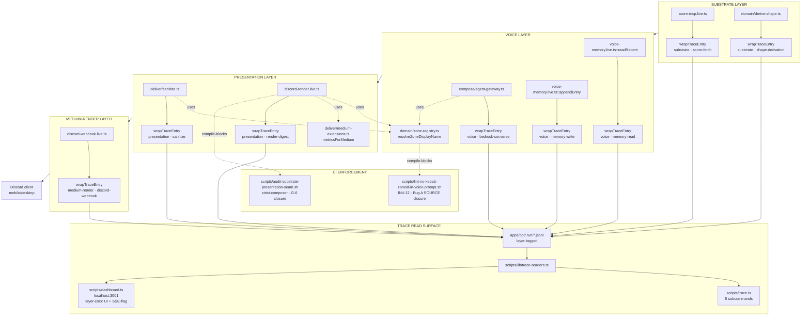

# cycle-007 · agent debuggability through medium-aware substrate-presentation layering · SDD

> Companion to `grimoires/loa/prd.md`. PRD = WHAT + WHY. SDD = HOW.
> **Cycle**: cycle-007 · agent-debuggability
> **Date**: 2026-05-17
> **Status**: candidate (post `/architect`)
> **Predecessor**: cycle-006 SDD at `grimoires/loa/cycles/cycle-006-substrate-presentation/sdd.md` (substrate-presentation seam established · honeycomb pattern in production)
> **Branch target**: `feat/cycle-007-agent-debuggability` (cut from `origin/main` @ `3324a8d` · 2026-05-16)
> **Persona**: ARCH (Ostrom) + craft lens (Alexander) for plan · BARTH for implement

---

## 1. System Overview

> **Framing (BB REFRAME-1 · 2026-05-17 · accept-minor)**: The DASHBOARD is the WITNESS to layer discipline · the FORCE FUNCTIONS are **INV-12 (CI lint at SOURCE)** + **trace envelope (universal layer tagging · type-enforced per HIGH-4)** + **agent CLI surface (paste-to-Loa)**. The dashboard makes the substrate legible — it doesn't enforce it. This distinction matters: substrate is load-bearing · UI is the celebration. S5 dashboard work is craft-polish, not cycle-spine.

Cycle-007 extends the cycle-006 honeycomb (`domain/ports/live/mock/orchestrator`) with three new substrates:

1. **Zone-display canonical registry** at `domain/zone-registry.ts` — a single source of truth for ZoneId → display-name + emoji + rich-label resolution. Replaces dual registries (`ZONE_FLAVOR` + `ZONE_LABEL`). Includes the sanitizer primitive `detectKebabZoneIds(text)` for SINK-side leak detection. SOURCE-side leak prevention enforced by a new CI lint (`scripts/lint-no-kebab-zoneid-in-voice-prompt.sh` · INV-12).
2. **Trace envelope** at `observability/trace-envelope.ts` — a 3-field additive wrapper (`layer + layer_op + emitted_at`) applied to every JSONL writer in `packages/persona-engine/src/`. Forward-only — cycle-006 traces remain raw and readers tolerate absent fields.
3. **Medium-aware presentation knobs** at `deliver/medium-extensions.ts` — locally-owned extension of `@0xhoneyjar/medium-registry@^0.2.0`'s `MediumCapability` adding `codeBlockMonoCharWidth`, `digitWidthSpaceChar` (U+2007 for Discord), `mobileProportionalWrap`, `emojiWidthInMonospace`, `codeBlockMobileFallbackRisk`. Renderers consult via `metricsForMedium(medium)` instead of hardcoded constants.

Plus two surfaces consuming the new substrates:

4. **Agent-first trace CLI** at `scripts/trace.ts` (5 subcommands: `latest`, `layer`, `get`, `voice`, `explain`) sharing readers with the dashboard via `scripts/lib/trace-readers.ts`. The `trace:explain` subcommand reads from STDIN (per Flatline SKP-002) and emits a stable v1 JSON schema (per IMP-003 · INV-13).
5. **Dashboard UI extension** at `scripts/dashboard.ts` — 4-color border encoding (oklch · per Alexander spec), detail-panel layer split, and SSE-behind-flag (`LOA_DASH_SSE=1`) layer-color flash on new event.

Cycle-006 orchestrator-port leak closure (G-6) is a mechanical cleanup happening in S7 — orchestrators stop importing `to*Payload` from `live/discord-webhook.live.ts` and route through `PresentationPort`.



### Key seam invariants (preserved from cycle-006 + extended)

| ID | invariant (carried from cycle-006) | cycle-007 extension |
|---|---|---|
| INV-1 | `live/discord-render.live.ts` must NOT import `live/claude-sdk.live.ts` or `compose/voice-brief.ts` | unchanged · still enforced by audit script |
| INV-2 | `domain/digest-message.ts::DeterministicEmbed` has NO `description` field | unchanged |
| INV-3 | Every orchestrator returns a domain message type | unchanged · S7 cleanup completes the closure |
| **INV-12 (NEW)** | Voice-prompt-producing files (manifest at `.claude/data/voice-prompt-paths.json` per BB HIGH-3) MUST NOT contain raw kebab ZoneId string literals outside `domain/zone-registry.ts` imports | Flatline IMP-004 · S1 acceptance gate · CI lint |
| **INV-13 (NEW)** | `trace:explain` JSON output schema FROZEN at v1 — changes require explicit `schema_version` bump · validated via ajv against `.claude/data/trace-explain-output.schema.json` at S4 acceptance (BB HIGH-5) | Flatline IMP-003 · `.claude/data/trace-explain-output.schema.json` |
| **INV-14 (NEW)** | `appendTraceEntry` is the SOLE permitted JSONL append helper in `packages/persona-engine/src/` · direct `Bun.write` / `fs.appendFile` calls on `.jsonl` paths in this package are forbidden · type signature requires `T & TraceEnvelope` enforcing compile-time discipline | BB HIGH-4 · S2 acceptance · audit script `scripts/audit-jsonl-append-discipline.sh` |
| **INV-15 (NEW)** | `wrapTraceEntry` recursively sanitizes nested reserved keys (`layer`, `layer_op`, `emitted_at` → `payload_*` prefix) · enforced by JSON schema at `.claude/data/trace-envelope.schema.json` validated by `appendTraceEntry` before write · prevents attacker-controlled payload field spoofing | Red Team AC-RT-005 (ATK-009 · 420 quick-fix) · S2 acceptance |
| **INV-16 (NEW)** | Dashboard SSE + REST endpoints require per-session bearer token (`LOA_DASH_TOKEN` printed to stderr at server start) via `X-Loa-Dash-Token` header AND Host header validation (`Host: 127.0.0.1:3001` or `Host: localhost:3001`) · 403 on miss · closes DNS-rebinding attack class | Red Team AC-RT-001 (ATK-001 · 780) · S5 acceptance |
| **INV-17 (NEW)** | INV-12 manifest (`.claude/data/voice-prompt-paths.json`) is path-monotonic across git history on main · `scripts/lint-manifest-monotonic.sh` CI-enforced · CODEOWNERS entry requires operator review for any change · git-history-aware variant of INV-12 lint scans paths EVER in the manifest | Red Team AC-RT-002 (ATK-002 · 760) · S1 acceptance |
| **INV-18 (NEW)** | Trace CLI human-format output sanitizes payload string values via `scripts/lib/safe-render.ts::sanitizeForTerminal` (strips C0/C1 control bytes + OSC 8 hyperlinks rendered as `[url]` plain-text) · ANSI emitted ONLY by the printer itself · prevents terminal escape injection (CVE-2003-0063 family) | Red Team AC-RT-003 (ATK-006 · 740) · S4 + S5 acceptance |

---

## 2. Component Specifications

### 2.1 `packages/persona-engine/src/domain/zone-registry.ts` (NEW · ~120 LoC)

**Purpose**: canonical map ZoneId → display + rich-label + sanitizer primitive. Replaces `score/types.ts::ZONE_FLAVOR` and `live/discord-render.live.ts::ZONE_LABEL`.

> **BB REFRAME-2 disposition (accept-minor)**: `richLabel` is Discord-specific (emoji + parenthetical dimension) and arguably belongs in `presentation/`. Cycle-007 keeps it in `domain/` to avoid mid-cycle refactor cost. Trade-off accepted: cycle-006 INV-1 (domain MUST NOT depend on presentation details) softens for `richLabel` specifically. **Cycle-008 follow-up task** filed: extract `resolveZoneRichLabel` + `richLabel` field to `packages/persona-engine/src/presentation/zone-display.ts` when Telegram adapter lands. Until then, `richLabel` documented as "Discord-shaped" by convention.

**Imports**:
```typescript
import { ZONE_IDS, type ZoneId, type ZoneDimension } from '../score/types.ts';
```

**Public API**:
```typescript
export class UnknownZoneError extends Error {
  constructor(public readonly attemptedZone: string) {
    super(`Zone "${attemptedZone}" not in ZONE_REGISTRY (expected one of: ${ZONE_IDS.join(', ')})`);
    this.name = 'UnknownZoneError';
  }
}

export interface ZoneDisplayRecord {
  readonly id: ZoneId;
  readonly emoji: string;
  readonly displayName: string;        // "El Dorado"  — for prose
  readonly dimension: ZoneDimension;
  readonly richLabel: string;          // "⛏️ El Dorado (NFT)" — for Discord headlines
}

export const ZONE_REGISTRY: Readonly<Record<ZoneId, ZoneDisplayRecord>> = Object.freeze({
  'el-dorado':   { id: 'el-dorado',   emoji: '⛏️', displayName: 'El Dorado',   dimension: 'NFT',   richLabel: '⛏️ El Dorado (NFT)' },
  'bear-cave':   { id: 'bear-cave',   emoji: '🐻', displayName: 'Bear Cave',   dimension: 'TOKEN', richLabel: '🐻 Bear Cave (TOKEN)' },
  'lounge':      { id: 'lounge',      emoji: '🛋️', displayName: 'Lounge',      dimension: 'CHAT',  richLabel: '🛋️ Lounge (CHAT)' },
  // ... full set pulled from current ZONE_FLAVOR · 4 zones total per MVP
});

/** Throws UnknownZoneError if zone not in registry (IMP-011). */
export function resolveZoneDisplayName(zone: ZoneId): string {
  const record = ZONE_REGISTRY[zone];
  if (!record) throw new UnknownZoneError(zone);
  return record.displayName;
}

/** Throws UnknownZoneError if zone not in registry (IMP-011). */
export function resolveZoneRichLabel(zone: ZoneId): string {
  const record = ZONE_REGISTRY[zone];
  if (!record) throw new UnknownZoneError(zone);
  return record.richLabel;
}

/**
 * Detects kebab ZoneId leaks in voice output for sanitizer hook (FR-1.4).
 * Matches case-insensitively at word boundaries · SKIPS false-positive contexts (IMP-002):
 * - Fenced code blocks (``` ... ```)
 * - Discord emoji syntax (:name: or <:name:id>)
 * - URL path segments (https?://...)
 * - Inline code (`text`)
 * - Markdown link targets ([text](url))
 */
export function detectKebabZoneIds(text: string): ZoneId[] {
  // BB HIGH-2: NFKC normalize + Unicode dash substitution defensively (closes attack-shape
  // input where LLM produces 'el‐dorado' U+2010, 'el—dorado' U+2014, etc.). Same pattern
  // class as Loa cycle-098 sprint-7 cypherpunk HIGH-2 (L7 SOUL prescriptive matching).
  const normalized = text
    .normalize('NFKC')
    .replace(/[‐-―−]/g, '-');   // U+2010-U+2015 dash variants + U+2212 minus → ASCII hyphen

  // Strip false-positive contexts (IMP-002 allowlist)
  const stripped = normalized
    .replace(/```[\s\S]*?```/g, '')                     // fenced code
    .replace(/`[^`\n]+`/g, '')                          // inline code
    .replace(/:[a-z0-9_-]+:/gi, '')                     // Discord emoji syntax
    .replace(/<:[a-z0-9_-]+:\d+>/gi, '')                // Discord custom emoji
    .replace(/https?:\/\/\S+/gi, '')                    // URLs
    .replace(/\([^)]*\)/g, '');                         // markdown link targets (loose)

  const hits = new Set<ZoneId>();
  for (const zone of ZONE_IDS) {
    const pattern = new RegExp(`\\b${zone}\\b`, 'i');
    if (pattern.test(stripped)) hits.add(zone);
  }
  return Array.from(hits);
}

/** Compile-time exhaustiveness helper (TS-side INV-12 guard). */
export function assertNeverZone(zone: never): never {
  throw new UnknownZoneError(String(zone));
}
```

**Tests** (`domain/zone-registry.test.ts`):
- Every ZoneId in `ZONE_IDS` has a registry entry (compile-time + runtime assertion).
- `resolveZoneDisplayName('el-dorado') === 'El Dorado'`
- `resolveZoneRichLabel('el-dorado').startsWith('⛏️')`
- `resolveZoneDisplayName('does-not-exist' as ZoneId)` throws `UnknownZoneError` (IMP-011)
- `detectKebabZoneIds('el-dorado wakes')` returns `['el-dorado']`
- `detectKebabZoneIds('use :el-dorado: emoji')` returns `[]` (false-positive allowlist · IMP-002)
- `detectKebabZoneIds('``el-dorado``')` returns `[]` (code block)
- `detectKebabZoneIds('see https://example.com/el-dorado/x')` returns `[]` (URL)
- `detectKebabZoneIds('[link](https://example.com/el-dorado)')` returns `[]` (markdown link)
- Case-insensitivity: `detectKebabZoneIds('El-Dorado')` returns `['el-dorado']`
- **BB HIGH-2 Unicode bypass tests** (added 2026-05-17):
  - `detectKebabZoneIds('el‐dorado wakes')` (U+2010 HYPHEN) → `['el-dorado']`
  - `detectKebabZoneIds('el—dorado roars')` (U+2014 EM DASH) → `['el-dorado']`
  - `detectKebabZoneIds('el–dorado stirs')` (U+2013 EN DASH) → `['el-dorado']`
  - `detectKebabZoneIds('el−dorado')` (U+2212 MINUS) → `['el-dorado']`
- **Flatline IMP-002 (845) ReDoS benchmark test** (Phase 4 · 2026-05-17): regex matched against synthetic 10K-char attacker input (pathological-backtracking shapes: long sequences of `el-doradoel-doradoel-dorado...` interleaved with dash variants) MUST complete in <50ms wall-clock. Pins linear-time regex behavior · prevents ReDoS regression if future detector rewrites add backtracking.
  - Confusable-script Latin/Cyrillic mix (e.g., 'еl-dorado' with Cyrillic Ye U+0435): documented gap · NFKC does NOT collapse Latin/Cyrillic homoglyphs · V2 work if observed in voice output

**Modifications elsewhere**:
- `score/types.ts`: DELETE `ZONE_FLAVOR` (keep `ZONE_IDS` + `ZoneDimension` type · re-export).
- `live/discord-render.live.ts`: DELETE `ZONE_LABEL` constant · replace with `resolveZoneRichLabel(zone)` call **wrapped in try/catch** (Flatline SKP-003/HIGH closure · see below).
- `persona/loader.ts:267`: replace `ZONE_FLAVOR[zone].name` with `resolveZoneDisplayName(zone)` (sanity-only · already correct semantics) **wrapped in try/catch**.
- `compose/voice-brief.ts::ZONE_VOICE_CONTEXT`: audit · interpolation through `resolveZoneDisplayName` (S1/T1.4) **wrapped in try/catch**.
- `deliver/sanitize.ts`: kebab detector caller wraps in try/catch.

> **Flatline SKP-003/HIGH (Phase 4 · 2026-05-17 · UnknownZoneError caller safety)**: `resolveZoneDisplayName` and `resolveZoneRichLabel` throw `UnknownZoneError` per IMP-011 (Flatline Phase 2). All CALLERS in production paths (live/discord-render, deliver/sanitize, persona/loader, compose/voice-brief) MUST wrap calls in try/catch:
>
> ```typescript
> let displayName: string;
> try {
>   displayName = resolveZoneDisplayName(zone);
> } catch (e) {
>   if (e instanceof UnknownZoneError) {
>     // Emit OTEL counter — track resolution failures without crashing pipeline
>     otelCounter('zone.resolution_failed').inc({ zone: e.attemptedZone, caller: 'discord-render' });
>     displayName = String(zone);  // safe fallback to raw ZoneId · UI shows raw kebab once · operator sees the failure in telemetry
>   } else {
>     throw e;  // re-throw unexpected errors
>   }
> }
> ```
>
> This pattern preserves IMP-011's strictness (resolver throws on unknown) while ensuring an LLM hallucination or data-corruption injection of unknown zone IDs does NOT crash the digest pipeline. The fallback shows the raw kebab ID to users ONCE — operator triages via OTEL counter and fixes the source. Acceptable trade-off: a single bad render vs total pipeline crash. Tests verify both the throw (registry-internal) AND the catch (caller resilience).

### 2.2 `packages/persona-engine/src/observability/trace-envelope.ts` (NEW · ~90 LoC)

**Purpose**: 3-field additive envelope for every JSONL writer. Forward-only. **Type-enforced per BB HIGH-4**: the JSONL append helper signature requires `T & TraceEnvelope`, making `wrapTraceEntry` the ONLY way to construct values acceptable for append. Compile-time enforcement closes the "enforced by vigilance" gap (cycle-006 lesson).

**Imports**: none (pure helper).

**Public API**:
```typescript
export const TRACE_LAYERS = ['substrate', 'voice', 'presentation', 'medium-render', 'orchestrator'] as const;
export type TraceLayer = typeof TRACE_LAYERS[number];

export interface TraceEnvelope {
  readonly layer: TraceLayer;
  readonly layer_op: string;       // e.g., 'bedrock-converse' · 'render-digest' · 'snapshot-rejection'
  readonly emitted_at: string;     // ISO 8601 · `new Date().toISOString()`
}

/**
 * Wraps a payload in the trace envelope. Idempotent on already-wrapped payloads (no double-wrapping).
 * Envelope fields ALWAYS override caller-supplied keys of the same name (defensive against
 * attacker-controlled payload fields like { layer: 'admin' }).
 */
export function wrapTraceEntry<T>(layer: TraceLayer, layer_op: string, payload: T): T & TraceEnvelope {
  // Red Team AC-RT-005 (INV-15) · ATK-009 (420 quick-fix): sanitize NESTED reserved-keys
  // (rename nested layer/layer_op/emitted_at → payload_layer/* to prevent attacker-controlled
  // payload fields from biasing JSON-path-walking readers / future analytics aggregations).
  const sanitized = sanitizeNestedReservedKeys(payload);
  return {
    ...sanitized,
    layer,         // ← spread order: payload FIRST, envelope LAST, so envelope wins on conflict
    layer_op,
    emitted_at: new Date().toISOString(),
  };
}

const RESERVED_KEYS = new Set(['layer', 'layer_op', 'emitted_at']);

/** INV-15: recursively rename nested reserved-keys to payload_* prefix (top-level keys handled by spread-order). */
function sanitizeNestedReservedKeys<T>(value: T, depth = 0): T {
  if (depth >= 32) return value;  // bound recursion (defense against JSON-bomb-style nested structures)
  if (Array.isArray(value)) return value.map(v => sanitizeNestedReservedKeys(v, depth + 1)) as unknown as T;
  if (value && typeof value === 'object') {
    const out: Record<string, unknown> = {};
    for (const [k, v] of Object.entries(value as Record<string, unknown>)) {
      const safeKey = depth > 0 && RESERVED_KEYS.has(k) ? `payload_${k}` : k;
      out[safeKey] = sanitizeNestedReservedKeys(v, depth + 1);
    }
    return out as T;
  }
  return value;
}

export function isTraceEnvelope(value: unknown): value is TraceEnvelope {
  return (
    typeof value === 'object' && value !== null &&
    'layer' in value && TRACE_LAYERS.includes((value as TraceEnvelope).layer) &&
    'layer_op' in value && typeof (value as TraceEnvelope).layer_op === 'string' &&
    'emitted_at' in value && typeof (value as TraceEnvelope).emitted_at === 'string'
  );
}

/**
 * BB HIGH-4 · type-enforced JSONL append. SOLE allowed path to append JSONL trace rows in
 * packages/persona-engine/src/. Signature requires T & TraceEnvelope, so only values produced
 * by wrapTraceEntry compile against this surface. INV-4 enforced at compile-time.
 *
 * Existing direct fs.appendFile calls in writers MUST migrate to this helper at S2.
 *
 * Flatline IMP-003 semantics (post-Phase-4):
 *  - Best-effort write · no fsync · OS buffer is the durability boundary
 *  - NO file-locking · single-process invariant (matches cycle-006 SKP-001/HIGH voice-memory mutex pattern)
 *  - Concurrent writers in the same process serialize via Bun.write internal queueing
 *  - Multi-process writes are UNSUPPORTED · would interleave bytes mid-line · file-header documents this
 *  - On write failure: caller MAY retry · helper does not auto-retry · errors propagate as rejected promise
 *  - On disk-full / permission error: caller logs to stderr · does NOT crash the parent process
 */
export async function appendTraceEntry<T extends TraceEnvelope>(filePath: string, entry: T): Promise<void> {
  const line = JSON.stringify(entry) + '\n';
  await Bun.write(filePath, line, { append: true });
}
```

> **Flatline SKP-001/HIGH (Phase 4 · 2026-05-17)**: INV-14 audit script `scripts/audit-jsonl-append-discipline.sh` strengthened with defense-in-depth patterns + module-import discipline check (no new deps · PRAISE-3 holds). Greps for:
> 1. `appendFile.*\.jsonl|fs\.write.*\.jsonl|createWriteStream.*\.jsonl`
> 2. `Bun\.write.*\.jsonl.*append` (in any binding form — also catches `const writer = Bun.write`)
> 3. `import.*'fs'|import.*'node:fs'|import.*'fs/promises'` outside `packages/persona-engine/src/observability/` (defensive — the persona-engine package should not need fs imports outside the observability module)
>
> AST-level enforcement via ts-morph / biome / eslint deferred to V2 if convention proves insufficient (would add npm dep · violates PRAISE-3 zero-deps discipline). Defense-in-depth limit acknowledged: a sufficiently determined developer can bypass grep via runtime path construction (e.g., `const p = ['foo', 'jsonl'].join('.'); await Bun.write(p, ...)`). Mitigation: code review at PR time · audit script runs in CI · S2 acceptance gate.

> **BB HIGH-4 follow-on (cycle-007)**: a sibling invariant — **INV-14: `appendTraceEntry` is the SOLE permitted JSONL append helper in `packages/persona-engine/src/`. Direct `Bun.write` / `fs.appendFile` calls on `.jsonl` files in this package are forbidden.** Verified by audit script `scripts/audit-jsonl-append-discipline.sh` at S2 close · CI-integrated at S2 per Flatline IMP-007 (765 avg) · pattern set strengthened per Flatline SKP-001/HIGH (see semantics block above).

**Tests** (`observability/trace-envelope.test.ts`):
- `wrapTraceEntry('substrate', 'score-fetch', { zone: 'el-dorado' })` returns shape `{ zone, layer, layer_op, emitted_at }`.
- `emitted_at` is a valid ISO 8601 string.
- `isTraceEnvelope` returns `false` for pre-cycle-007 fixture (absent `layer` field) — confirms backwards-compat boundary.
- TraceLayer enum frozen at 5 values.

**Modifications elsewhere** (S2 sweep):
| File | callsite | wrap |
|---|---|---|
| `compose/agent-gateway.ts::writeLlmTraceEntry` | 2 sites | `wrapTraceEntry('voice', 'bedrock-converse', entry)` |
| `live/voice-memory.live.ts::appendEntry` | 1 site | `wrapTraceEntry('voice', 'memory-write', entry)` |
| `live/voice-memory.live.ts::forgetUser` | 1 site (audit log) | `wrapTraceEntry('voice', 'memory-forget', { stream, key, reason })` |
| `live/score-mcp.live.ts::recordRejection` | 1 site | `wrapTraceEntry('substrate', 'snapshot-rejection', rejection)` |
| `deliver/sanitize.ts::stripVoiceDisciplineDrift` (NEW write) | 1 site (kebab leak log) | `wrapTraceEntry('presentation', 'sanitize-violation', { violations, sample })` |

### 2.3 `packages/persona-engine/src/deliver/medium-extensions.ts` (NEW · ~90 LoC)

**Purpose**: locally-owned extension of upstream `MediumCapability` with Discord-specific render knobs. Upstream proposal AT cycle close (INV-7).

**Imports**:
```typescript
import type { MediumCapability } from '@0xhoneyjar/medium-registry';
import { DISCORD_WEBHOOK_DESCRIPTOR } from '@0xhoneyjar/medium-registry';
```

**Public API**:
```typescript
export interface ExtendedMediumMetrics {
  readonly codeBlockMonoCharWidth: number;
  readonly codeBlockMobileFallbackRisk: 'high' | 'low' | 'none';
  readonly digitWidthSpaceChar: string;        // ALWAYS ' ' or ' ' — assert with codePointAt
  readonly mobileProportionalWrap: number;
  readonly emojiWidthInMonospace: 1 | 2;
}

/**
 * Discord-extended descriptor. The digitWidthSpaceChar is explicitly ' ' (FIGURE SPACE)
 * for OpenType-tabular-figure-width-invariance across font fallback (Android `gg sans` regression).
 *
 * Values informed by S0/T0.2 Discord Android typography spike — operator-attested at sprint close.
 */
export const DISCORD_EXTENDED: ExtendedMediumMetrics = Object.freeze({
  codeBlockMonoCharWidth: 38,                  // discord.js#3030 wrap-at-40 minus 2 safety
  codeBlockMobileFallbackRisk: 'high',         // Android sans-serif regression
  digitWidthSpaceChar: ' ',               // FIGURE SPACE · digit-width-invariant
  mobileProportionalWrap: 40,
  emojiWidthInMonospace: 2,
});

export const CLI_EXTENDED: ExtendedMediumMetrics = Object.freeze({
  codeBlockMonoCharWidth: 80,                  // terminal default
  codeBlockMobileFallbackRisk: 'none',
  digitWidthSpaceChar: ' ',               // ASCII space — terminal is monospace
  mobileProportionalWrap: 80,
  emojiWidthInMonospace: 1,
});

/** Thrown by metricsForMedium when an unregistered medium descriptor is passed. */
export class UnsupportedMediumError extends Error {
  constructor(public readonly mediumId: string) {
    super(`No extended metrics registered for medium "${mediumId}" · register a descriptor before use`);
    this.name = 'UnsupportedMediumError';
  }
}

/**
 * Resolves the extended metrics for a given upstream medium descriptor.
 * BB MEDIUM-5: throws on unregistered mediums instead of silently defaulting — forces conscious
 * decision when adding medium support (prevents silent ASCII-padded output to Telegram, etc.).
 */
export function metricsForMedium(medium: MediumCapability): ExtendedMediumMetrics {
  if (medium === DISCORD_WEBHOOK_DESCRIPTOR) return DISCORD_EXTENDED;
  // V1 ships Discord + CLI only · CLI is identified by descriptor-id match
  if ((medium as { id?: string }).id === 'cli') return CLI_EXTENDED;
  throw new UnsupportedMediumError((medium as { id?: string }).id ?? 'unknown');
}
```

**Tests** (`deliver/medium-extensions.test.ts`):
- `DISCORD_EXTENDED.digitWidthSpaceChar.codePointAt(0) === 0x2007` (codepoint identity · SKP-002 hardening)
- `DISCORD_EXTENDED.digitWidthSpaceChar !== ' '` (ASCII-negative assertion · IMP-006)
- `DISCORD_EXTENDED.digitWidthSpaceChar.length === 1` (sanity · still useful even though insufficient alone)
- `metricsForMedium(DISCORD_WEBHOOK_DESCRIPTOR) === DISCORD_EXTENDED`
- **Flatline SKP-002/HIGH (Phase 4 · 720) spec/test alignment**: `metricsForMedium(unregisteredMedium)` throws `UnsupportedMediumError` (replaces previous `=== CLI_EXTENDED` assertion · matches BB MEDIUM-5 spec)
- **CLI descriptor fixture**: define `CLI_DESCRIPTOR = { id: 'cli', ...minimal-fields }` · `metricsForMedium(CLI_DESCRIPTOR) === CLI_EXTENDED` (explicit registered path)
- DISCORD_EXTENDED is frozen (mutation throws in strict mode)

**Modifications elsewhere**:
- `live/discord-render.live.ts::renderSnapshotField` (S3/T3.3): consume `metricsForMedium(medium).digitWidthSpaceChar` for `padEnd` + `padStart` · consume `metricsForMedium(medium).codeBlockMonoCharWidth` for value-column cap · NO hardcoded `1024 / 6000 / 19 / 40 / 38` remains.

### 2.4 `scripts/lib/trace-readers.ts` (NEW · ~140 LoC)

**Purpose**: shared trace-reader functions used by both `scripts/dashboard.ts` and `scripts/trace.ts`. Extracted from existing dashboard logic.

**Public API**:
```typescript
import type { TraceLayer } from '../../packages/persona-engine/src/observability/trace-envelope.ts';

export interface TraceRow {
  readonly layer: TraceLayer | 'unknown';   // 'unknown' for pre-cycle-007 rows
  readonly layer_op: string | null;
  readonly emitted_at: string | null;
  readonly raw: Record<string, unknown>;     // full original JSONL payload
  readonly source_file: string;              // path of origin file
  readonly line_number: number;              // 1-indexed
}

export interface ReadOpts {
  readonly zone?: string;
  readonly layer?: TraceLayer;
  readonly limit?: number;
  readonly since?: string;                   // ISO 8601 — emitted_at >= since
}

/** Read N most-recent rows across all known trace files. */
export async function readLatest(opts: ReadOpts): Promise<TraceRow[]>;

/** Read by run_id / trace UUID across all files. */
export async function readByRunId(runId: string): Promise<TraceRow | null>;

/** Filter by layer (and optionally zone). */
export async function readByLayer(layer: TraceLayer, opts: ReadOpts): Promise<TraceRow[]>;

/** Voice-specific reader (prompt + response + tokens from llm-trace.jsonl). */
export async function readVoice(zone: string, opts: ReadOpts): Promise<TraceRow[]>;

/** Parse a single pasted JSON row, identify layer + likely file:line. */
export function explainRow(rawJson: string): ExplainedRow;

export interface ExplainedRow {
  readonly schema_version: '1';              // INV-13 frozen at v1
  readonly identified_layer: TraceLayer | 'unknown';
  readonly identified_op: string | null;
  readonly likely_source: {
    readonly file: string;
    readonly line_range: [number, number];
  } | null;
  readonly raw: Record<string, unknown>;
  readonly warnings: string[];                // e.g., "row predates envelope · layer inferred from shape"
}

/** Known JSONL trace files — explicit allowlist (SKP-001/CRITICAL closure). */
export const FREESIDE_CHARACTERS_TRACE_FILES = [
  'apps/bot/.run/llm-trace.jsonl',
  // glob: apps/bot/.run/voice-memory/**/*.jsonl
  'apps/bot/.run/score-snapshot-rejections.jsonl',
] as const;
```

**Notes**:
- Path resolution is relative to repo root (Bun script convention).
- Reader returns `layer: 'unknown'` for pre-cycle-007 rows (absent envelope · IMP-012 reader-tolerance).
- `explainRow` is the workhorse for `trace:explain` CLI; identifies layer from envelope field first, falls back to heuristics (presence of `prompt + response + tokens` → voice/bedrock-converse · `wallet_changes` → substrate · etc.) for pre-envelope rows.
- **BB MEDIUM-1 operational note**: `readLatest` reads ALL allowlisted files on each invocation. Cold-cache. After ~3 months of digest cron + slash command interactions, `voice-memory/**/*.jsonl` glob may reach 100s of MB · invocation latency grows to ~200-500ms. Document this in `docs/trace-cli.md`. **V2 follow-up**: `.run/trace-index.jsonl` incrementally updated on JSONL appends · enables O(1) lookups by layer / zone / time-range.

**Tests** (`scripts/lib/trace-readers.test.ts`):
- `readLatest({ limit: 5 })` returns ≤5 rows across all files.
- `readByLayer('voice', {})` returns only `layer === 'voice'` rows.
- `readByRunId('test-uuid-X')` returns the matching row or null.
- `explainRow(envelopeRow)` returns `identified_layer` matching envelope.
- `explainRow(legacyRow)` returns `identified_layer: 'unknown'` + heuristic-inferred `layer_op` + warning.
- Reader tolerates absent fields on legacy fixture (IMP-012).

### 2.5 `scripts/trace.ts` (NEW · ~280 LoC)

**Purpose**: agent-first CLI for trace debugging. 5 subcommands. STDIN-first for `trace:explain` (SKP-002).

**CLI Surface**:
```bash
bun run trace:latest [--zone X] [--layer L] [--limit N] [--format human|json]
bun run trace:get --run-id Y [--format human|json]
bun run trace:layer --layer L [--zone X] [--limit N] [--format human|json]
bun run trace:voice --zone X [--limit N] [--format human|json]
bun run trace:explain [--file PATH] [--format human|json]
  # STDIN canonical: pbpaste | bun run trace:explain
  # File alt: bun run trace:explain --file ./row.json
  # Positional arg: REJECTED with usage error per SKP-002
```

**Implementation sketch**:
```typescript
#!/usr/bin/env bun
import { readLatest, readByRunId, readByLayer, readVoice, explainRow } from './lib/trace-readers.ts';

const args = parseArgs(process.argv.slice(2));
const subcommand = args._[0];

switch (subcommand) {
  case 'latest': {
    const rows = await readLatest({ zone: args.zone, layer: args.layer, limit: args.limit ?? 10 });
    return emit(rows, args.format ?? 'json');
  }
  case 'get': {
    const row = await readByRunId(args['run-id']);
    return emit(row, args.format ?? 'json');
  }
  case 'layer': {
    const rows = await readByLayer(args.layer, { zone: args.zone, limit: args.limit ?? 10 });
    return emit(rows, args.format ?? 'json');
  }
  case 'voice': {
    const rows = await readVoice(args.zone, { limit: args.limit ?? 10 });
    return emit(rows, args.format ?? 'json');
  }
  case 'explain': {
    // SKP-002: STDIN-first · positional arg REJECTED
    if (args._.length > 1) {
      console.error('Error: trace:explain reads from stdin or --file <path>. Positional argument unsupported (shell-escaping risk).');
      console.error('Usage: pbpaste | bun run trace:explain  OR  bun run trace:explain --file ./row.json');
      process.exit(2);
    }
    let rawJson: string;
    if (args.file) {
      // BB HIGH-1: realpath-canonicalize + repo-root containment + allowlist glob
      // Flatline IMP-012 (DISPUTED · GPT+Gem 850/850): explicit repo-root discovery — walk up to find .git OR root package.json with workspaces
      const repoRoot = await findRepoRoot();   // see findRepoRoot impl note below
      const canonical = await Bun.realpath(args.file).catch(() => null);
      if (!canonical) { console.error(`Error: file not found: ${args.file}`); process.exit(3); }
      if (!canonical.startsWith(repoRoot + '/')) {
        console.error(`Error: --file path escapes repo root: ${canonical}`); process.exit(3);
      }
      // Flatline SKP-001/HIGH (760): .jsonl files are multi-row · explainRow expects single row · require explicit row selector
      // Red Team ATK-007 (580) quick-fix: STRICT membership against FREESIDE_CHARACTERS_TRACE_FILES allowlist
      // (closes symlink-laundering surface · fixture .json loading requires LOA_TRACE_TEST_MODE=1).
      const isTraceFile = FREESIDE_CHARACTERS_TRACE_FILES.some(allowed =>
        canonical === `${repoRoot}/${allowed}` ||
        (allowed.includes('**') && canonical.match(new RegExp(allowed.replace(/\*\*/g, '.*'))))
      );
      const isFixture = canonical.endsWith('.json') && process.env.LOA_TRACE_TEST_MODE === '1';
      if (!isTraceFile && !isFixture) {
        console.error(`Error: --file must be in FREESIDE_CHARACTERS_TRACE_FILES allowlist OR fixture .json with LOA_TRACE_TEST_MODE=1: ${canonical}`); process.exit(3);
      }
      if (isTraceFile && !args.line && !args['run-id'] && !args.latest) {
        console.error(`Error: --file on .jsonl requires row selector: --line N | --run-id Y | --latest`);
        console.error(`Example: bun run trace:explain --file .run/llm-trace.jsonl --latest`);
        process.exit(3);
      }
      const fileText = await Bun.file(canonical).text();
      if (isTraceFile) {
        const lines = fileText.split('\n').filter(l => l.trim());
        if (args.latest) rawJson = lines[lines.length - 1];
        else if (args.line) rawJson = lines[args.line - 1];   // 1-indexed
        else /* run-id */ rawJson = lines.find(l => { try { return JSON.parse(l).run_id === args['run-id']; } catch { return false; } }) ?? '';
        if (!rawJson) { console.error(`Error: no row matching selector in ${canonical}`); process.exit(3); }
      } else {
        rawJson = fileText;
      }
    } else {
      // Flatline IMP-001 + SKP-002/HIGH (780 + 895): STREAMING stdin reader with 1MB byte-count limit
      // (NOT `await Bun.stdin.text()` which is unbounded → memory exhaustion DoS vector)
      const MAX_STDIN_BYTES = 1024 * 1024;   // 1MB
      const chunks: Uint8Array[] = [];
      let totalBytes = 0;
      for await (const chunk of Bun.stdin.stream()) {
        totalBytes += chunk.byteLength;
        if (totalBytes > MAX_STDIN_BYTES) {
          console.error(`Error: stdin exceeded ${MAX_STDIN_BYTES} bytes — refusing to parse (DoS prevention)`);
          process.exit(4);
        }
        chunks.push(chunk);
      }
      rawJson = new TextDecoder().decode(Buffer.concat(chunks));
    }
    // Flatline IMP-001: structured exit on malformed JSON
    try { JSON.parse(rawJson); } catch (e) {
      console.error(`Error: malformed JSON input: ${(e as Error).message}`);
      process.exit(5);
    }
    const explained = explainRow(rawJson);
    return emit(explained, args.format ?? 'json');
  }
  default:
    console.error(`Unknown subcommand: ${subcommand}. Valid: latest, get, layer, voice, explain`);
    process.exit(2);
}

function emit(payload: unknown, format: 'human' | 'json'): void {
  if (format === 'json') return console.log(JSON.stringify(payload, null, 2));
  return console.log(humanFormat(payload));   // markdown + glyphs + NO ANSI unless TTY+no-NO_COLOR
}

/**
 * Flatline IMP-012 (DISPUTED 850 GPT/Gem) — explicit repo-root discovery algorithm.
 * Walk up from script location looking for .git directory OR root package.json with `workspaces` field.
 * Returns absolute path. Throws RepoRootNotFoundError if neither marker found within 10 levels up.
 */
async function findRepoRoot(): Promise<string> {
  let dir = await Bun.realpath(import.meta.dir);
  for (let i = 0; i < 10; i++) {
    if (await Bun.file(`${dir}/.git/HEAD`).exists()) return dir;
    try {
      const pkg = await Bun.file(`${dir}/package.json`).json();
      if (pkg.workspaces) return dir;
    } catch { /* not a package.json or invalid */ }
    const parent = dir.replace(/\/[^/]+$/, '');
    if (parent === dir) break;
    dir = parent;
  }
  throw new Error(`Cannot find repo root from ${import.meta.dir} (no .git or workspaces package.json within 10 levels up)`);
}
```

**Human format** (per INV-11):
- Layer glyphs: `▣ substrate · ◈ voice · ◆ presentation · ▶ medium-render · ♦ orchestrator · ? unknown`
- Two-line blocks per row: `[glyph] [layer] [layer_op] [emitted_at]` + most-important payload field
- Blank line between rows
- TTY-detected ANSI color (substrate-cool-blue · voice-warm-gold · presentation-sage-green · medium-render-lavender) — stripped when piped to file or `pbcopy`

**`trace:explain` JSON output schema** (INV-13 · `.claude/data/trace-explain-output.schema.json`):
```json
{
  "$schema": "https://json-schema.org/draft/2020-12/schema",
  "$id": "https://freeside-characters/trace-explain-output.v1.json",
  "type": "object",
  "additionalProperties": false,
  "required": ["schema_version", "identified_layer", "identified_op", "likely_source", "raw", "warnings"],
  "properties": {
    "schema_version": { "const": "1" },
    "identified_layer": { "enum": ["substrate", "voice", "presentation", "medium-render", "orchestrator", "unknown"] },
    "identified_op": { "type": ["string", "null"] },
    "likely_source": {
      "oneOf": [
        { "type": "null" },
        {
          "type": "object",
          "additionalProperties": false,
          "required": ["file", "line_range"],
          "properties": {
            "file": { "type": "string" },
            "line_range": { "type": "array", "items": { "type": "integer", "minimum": 1 }, "minItems": 2, "maxItems": 2 }
          }
        }
      ]
    },
    "raw": { "type": "object", "additionalProperties": true },
    "warnings": { "type": "array", "items": { "type": "string" } }
  }
}
```

**Package.json script aliases** (S4/T4.3):
```json
{
  "scripts": {
    "trace:latest":  "bun run scripts/trace.ts latest",
    "trace:get":     "bun run scripts/trace.ts get",
    "trace:layer":   "bun run scripts/trace.ts layer",
    "trace:voice":   "bun run scripts/trace.ts voice",
    "trace:explain": "bun run scripts/trace.ts explain"
  }
}
```

**Tests** (`scripts/trace.test.ts`):
- Each subcommand returns expected JSON shape (validated against schema where applicable).
- `trace:explain` with positional arg exits 2 with usage error (SKP-002).
- `trace:explain --file fixture.json` produces v1-schema-conforming output.
- `trace:explain` STDIN path: `echo '<row>' | trace.ts explain` works end-to-end.
- Human-format markdown snapshot per subcommand.
- **BB HIGH-1 path containment tests** (added 2026-05-17):
  - `trace:explain --file /etc/passwd` exits 3 with "escapes repo root" error
  - `trace:explain --file ../outside-repo.json` exits 3 with realpath check
  - `trace:explain --file scripts/trace.ts` exits 3 with "must point to .run/**/*.jsonl or **/*.json fixture"
  - `trace:explain --file .run/llm-trace.jsonl` succeeds (allowlisted .run/ path)
  - `trace:explain --file tests/fixtures/sample-row.json` succeeds (fixture .json path)
- **BB HIGH-5 schema validation test** (added 2026-05-17):
  - For each `trace:explain` fixture output, validate against `.claude/data/trace-explain-output.schema.json` using `ajv` (already in Loa framework deps per cycle-098 audit envelope work) · schema drift fails build at S4 acceptance
- **Flatline IMP-001 + SKP-002 STDIN streaming + size limit tests** (Phase 4 · 2026-05-17):
  - `echo '{}' | trace:explain` exits 0 with valid output (small payload happy path)
  - Crafted 2MB input piped into stdin exits 4 with "stdin exceeded 1048576 bytes" message · no OOM
  - Malformed JSON `echo 'not-json' | trace:explain` exits 5 with "malformed JSON input: ..." message
- **Flatline SKP-001 JSONL row-selector tests** (Phase 4 · 2026-05-17):
  - `trace:explain --file .run/llm-trace.jsonl` (no selector) exits 3 with "requires row selector: --line N | --run-id Y | --latest"
  - `trace:explain --file .run/llm-trace.jsonl --latest` returns last row
  - `trace:explain --file .run/llm-trace.jsonl --line 5` returns 5th row
  - `trace:explain --file .run/llm-trace.jsonl --run-id deadbeef` returns matching row OR exits 3 if not found
- **Flatline IMP-012 repo-root discovery tests** (Phase 4 · 2026-05-17):
  - `findRepoRoot()` returns first ancestor dir containing `.git/HEAD` OR `package.json` with `workspaces` field
  - Throws if neither found within 10 levels up

**Docs** (`docs/trace-cli.md` · S4/T4.5):
- Copy-paste examples · "paste-to-Loa" workflow walkthrough · screenshot of `bun run trace:explain` output.

### 2.6 Dashboard UI extension (`scripts/dashboard.ts`) — modifications + SSE-flag

**Modifications** (S5):
- Extract reader logic into `scripts/lib/trace-readers.ts` (T5.1 · shared with CLI).
- Add 3px left-border per row colored by layer (oklch palette per Alexander spec · T5.2).
- Add detail panel layer split: when row selected, panels for substrate/voice/presentation/medium-render render side-by-side or stacked viewport-adaptive (T5.3).
- Cross-layer connector lines (subtle 1px) in OTHER layer's color on right edge of panel when row has cross-layer attributes.
- Visual regression fixtures (T5.4): checked-in PNGs at `scripts/dashboard-fixtures/*.png` · operator-attested.
- **NEW T5.5 · SSE-behind-flag** (OP-Q4):
  - Server endpoint at `/sse` streams `data: <jsonl-row>\n\n` events when `LOA_DASH_SSE=1` set at server start.
  - **Flatline IMP-005 (855) security**: server explicitly bound to localhost — `Bun.serve({ hostname: '127.0.0.1', port: 3001 })` · NEVER `'0.0.0.0'` · NO CORS headers · Origin check on `/sse` handler rejects non-`http://localhost:3001` / non-`http://127.0.0.1:3001` origins with 403 · prevents cross-origin trace exfiltration if attacker convinces operator to open a malicious page while dashboard runs.
  - **Red Team AC-RT-001 (780 · INV-16) DNS-rebinding defense**: localhost-only + Origin check INSUFFICIENT against DNS rebinding (browser reuses Host header `attacker.example` but routes to 127.0.0.1:3001). Defense composes 3 checks:
    1. **Per-session bearer token**: dashboard generates `LOA_DASH_TOKEN = crypto.randomUUID()` at server start · prints to stderr (operator copies into terminal/browser).
    2. **Token required on /sse + ALL /api/* endpoints**: `X-Loa-Dash-Token` header (EventSource can't set custom headers — use query param `?token=$LOA_DASH_TOKEN`) · 403 on miss/mismatch.
    3. **Host header validation**: reject any request whose `Host` header is not in `{127.0.0.1:3001, localhost:3001}` · DNS-rebinding attacker page sends `Host: attacker.example` and gets 403.
  - **Red Team AC-RT-010 (380) per-token cap**: SSE client cap of 1 PER TOKEN (not per-IP/per-host) · forcibly evicts prior connections for same token · prevents reconnect-storm by malicious local processes (composes with AC-RT-001 token requirement — un-tokened or wrong-token connections rejected before counting against cap).
  - **Red Team AC-RT-003 (740 · INV-18) ANSI escape sanitization**: SSE-streamed payloads pass through `scripts/lib/safe-render.ts::sanitizeForTerminal()` (strips C0/C1 control bytes · OSC 8 hyperlinks → plain-text `[url]` suffixes) before transmission to browser (defense-in-depth · browser-side may also have XSS protections but server pre-sanitizes per cycle-007 craft policy).
  - Client: `if (window.__LOA_DASH_SSE__) new EventSource('/sse').onmessage = (ev) => animateRow(JSON.parse(ev.data));`
  - Layer-color flash: 200ms ease-out on border-left brightness boost (`oklch(L+10%/C/H)` for the layer color).
  - Default behavior: 2-second poll (unchanged from cycle-006 dashboard substrate).
  - **BB MEDIUM-2 · client cap + heartbeat**: server enforces `max-clients: 5` (configurable via `.loa.config.yaml::dashboard.sse.max_clients`) · sends `event: ping\n\n` every 60s · client cleanup on `EventSource.onerror`. Prevents file-descriptor exhaustion under buggy clients / runaway tabs.
  - **BB MEDIUM-3 · payload truncation**: SSE-streamed rows truncate `prompt` / `response` / large string fields to 500 chars (`+= '...[truncated]'` suffix) · full row remains available via existing `/api/llm-trace?run-id=Y` REST endpoint on click. Prevents main-thread jank from large LLM-payload JSON.parse on the client side.

**Acceptance** (per IMP-005 hardening):
- **Default path test**: dashboard with `LOA_DASH_SSE` unset · no `/sse` requests · no EventSource attempts (regression guard against silent SSE-on default)
- **Enabled path test**: `LOA_DASH_SSE=1` → EventSource attaches · new row triggers flash · poll cadence suppressed
- **Rollback path test**: SSE-enabled then unset+restart · dashboard reverts cleanly · no EventSource leftover state

**CSS palette** (checked-in fixtures · INV-10):
```css
--layer-substrate:     oklch(64% 0.10 230);   /* cool blue */
--layer-voice:         oklch(72% 0.14 80);    /* warm gold */
--layer-presentation:  oklch(70% 0.10 160);   /* sage green */
--layer-medium-render: oklch(68% 0.10 320);   /* lavender */
--layer-orchestrator:  oklch(66% 0.08 280);   /* dim purple — secondary */
--layer-unknown:       oklch(50% 0.04 0);     /* neutral grey */
```

### 2.7 `scripts/lint-no-kebab-zoneid-in-voice-prompt.sh` (NEW · INV-12 · ~60 LoC bash)

**Purpose**: CI lint guard against kebab ZoneId string literals in voice-prompt-producing files. Closes Bug A SOURCE-side (Flatline IMP-004).

**BB HIGH-3 hardening (2026-05-17)**: voice-prompt-file allowlist is **manifest-based**, not hardcoded. Manifest at `.claude/data/voice-prompt-paths.json` is operator-authored + version-controlled. cycle-008+ can add new voice-prompt-producing paths to the manifest without touching the lint script. Format:

```json
{
  "$schema": "voice-prompt-paths.v1.json",
  "description": "Files/dirs whose contents reach the LLM prompt at compose-time. INV-12 lint scans these for raw kebab ZoneId literals outside zone-registry imports.",
  "paths": [
    "packages/persona-engine/src/compose",
    "packages/persona-engine/src/persona",
    "packages/persona-engine/src/live/claude-sdk.live.ts"
  ],
  "exclude": [
    "packages/persona-engine/src/domain/zone-registry.ts"
  ]
}
```

Lint script reads manifest, falls back to safe default (current hardcoded list) if manifest missing, emits stderr warning. Manifest absence is NOT a build failure (cycle-007 ships baseline manifest at S1).

```bash
#!/usr/bin/env bash
set -euo pipefail

MANIFEST='.claude/data/voice-prompt-paths.json'
if [[ -f "$MANIFEST" ]]; then
  mapfile -t VOICE_PROMPT_FILES < <(jq -r '.paths[]' "$MANIFEST")
  mapfile -t EXCLUDE_FILES < <(jq -r '.exclude[]' "$MANIFEST")
else
  echo "WARNING: $MANIFEST missing · using hardcoded fallback" >&2
  VOICE_PROMPT_FILES=(
    packages/persona-engine/src/compose
    packages/persona-engine/src/persona
    packages/persona-engine/src/live/claude-sdk.live.ts
  )
  EXCLUDE_FILES=('packages/persona-engine/src/domain/zone-registry.ts')
fi

ZONE_IDS=$(jq -r '.[]' .claude/data/zone-ids.json)  # or fall back to grep on registry source

violations=0
for zone in $ZONE_IDS; do
  while IFS= read -r line; do
    file="${line%%:*}"
    line_num="${line#*:}"; line_num="${line_num%%:*}"
    content="${line#*:*:}"
    # Skip allowlisted exclude files (manifest-driven)
    skip=false
    for excl in "${EXCLUDE_FILES[@]}"; do
      [[ "$file" == "$excl" ]] && skip=true && break
    done
    [[ "$skip" == true ]] && continue
    # Flatline SKP-001/CRITICAL (Phase 4 · 850) FIX: skip ONLY if THIS LINE is the registry import statement.
    # Original logic ('grep zone-registry in file && grep $zone in first 50 lines && continue') was a CRITICAL false-negative:
    # a developer could import the registry and still leak '"el-dorado"' literal on line 60 — the linter would silently allow it.
    # New logic: a violation line is allowed ONLY if the line itself is the import statement bringing in the registry symbol.
    if echo "$content" | grep -qE "^\s*import\b.*zone-registry"; then
      continue
    fi
    echo "INV-12 violation: '$zone' literal in $line"
    violations=$((violations + 1))
  done < <(grep -RnE "['\"]${zone}['\"]" "${VOICE_PROMPT_FILES[@]}" 2>/dev/null || true)
done

[[ $violations -eq 0 ]] && { echo "INV-12: 0 voice-prompt kebab leaks"; exit 0; } || { echo "INV-12: $violations violations · fix or import from zone-registry"; exit 1; }
```

**Integration** (S1/T1.5 — new task added for INV-12):
- Wire into GitHub Actions: new step in `.github/workflows/ci.yml` calling `bash scripts/lint-no-kebab-zoneid-in-voice-prompt.sh`.
- Local: `bun run lint:zone-source` alias.

**Flatline IMP-013 (DISPUTED 770 GPT/700 Gem) manifest-fallback discipline**: if `.claude/data/voice-prompt-paths.json` exists but FAILS JSON Schema validation against `.claude/data/voice-prompt-paths.schema.json`, the lint script MUST exit non-zero with a CI error ("manifest malformed · refusing to fall back silently"). The hardcoded-list fallback fires ONLY when the manifest FILE is absent (allowing first-time bootstrap before S1 ships the manifest). This prevents an attacker (or sloppy refactor) from corrupting the manifest to bypass INV-12 silently.

### 2.8 Spike scripts (auto-delete on cycle close · S0)

**T0.1 · `scripts/spike-zone-registry-callers.ts`** (~30 LoC, auto-delete):
- Runs `git grep -rnE "ZONE_FLAVOR|ZONE_LABEL"` across `packages apps scripts`.
- Outputs Markdown table of `file:line · variable · context` to `sprint-0-COMPLETED.md`.
- Operator confirms scope (or expands if hidden callers found).
- Deletes self at sprint close.

**T0.2 · `scripts/spike-discord-android-typography.ts`** (~80 LoC, auto-delete · SKP-003):
- Generates a synthetic Discord embed with 4 padding variants:
  1. ASCII space (` `) — control / current behavior
  2. FIGURE SPACE (` `) — primary candidate
  3. PUNCTUATION SPACE (` `) — alt
  4. NO-BREAK SPACE (` `) — alt
  5. Code-block alternative (triple-backtick wrap with different font hint)
- Posts to a test Discord channel via webhook (uses existing webhook from `.env.example`).
- Operator captures Android screenshots of each variant.
- Operator visually picks winning padding char (record in `sprint-0-COMPLETED.md`).
- **BB MEDIUM-4 decision-capture**: spike script appends a STRUCTURED block to `sprint-0-COMPLETED.md` (operator-fillable template with `chosen padding char`, `evidence path`, `rationale`, `fallback list`) so S3 reads the decision deterministically and is gated on it being filled (no silent default drift).
- **Flatline IMP-014 (DISPUTED 690) explicit schema** (Phase 4 · 2026-05-17): the appended block conforms to JSON Schema at `.claude/data/cycle-007-t02-decision.schema.json` with required fields: `chosen_padding_char` (Unicode escape pattern `^\u[0-9A-F]{4}$`), `evidence_paths` (array of relative paths), `rationale` (non-empty string), `fallback_chain` (array of padding-char escapes ordered by preference). S3 reads the YAML/JSON block, validates against schema, refuses to start if validation fails. Prevents drift between operator's freeform "I picked X" and S3's deterministic implementation.
- DISCORD_EXTENDED.digitWidthSpaceChar set per spike conclusion (defaults to ` ` unless spike says otherwise).
- Deletes self at sprint close.

---

## 3. Test Plan

| FR | test target | location |
|---|---|---|
| FR-1.1 | zone-registry public API · throw on unknown · canonical resolution | `domain/zone-registry.test.ts` |
| FR-1.4 | sanitizer hook fires `voice.kebab_zone_leak_detected` OTEL event on injected kebab fixture | `deliver/sanitize.test.ts` (S6) |
| FR-1.5 | detectKebabZoneIds false-positive allowlist | `domain/zone-registry.test.ts` |
| FR-2.1 | DISCORD_EXTENDED.digitWidthSpaceChar codepoint identity | `deliver/medium-extensions.test.ts` |
| FR-2.4 | byte-snapshot of renderSnapshotField output containing U+2007 bytes | `live/discord-render.live.test.ts` |
| FR-3.1 | wrapTraceEntry shape · idempotency · isTraceEnvelope predicate | `observability/trace-envelope.test.ts` |
| FR-3.3 | reader-tolerance fixture (pre-envelope + post-envelope mixed) | `scripts/lib/trace-readers.test.ts` |
| FR-4.2 | trace:explain STDIN-first · positional-arg REJECT · file path | `scripts/trace.test.ts` |
| FR-4.3 | trace:explain JSON output validates against `.claude/data/trace-explain-output.schema.json` | `scripts/trace.test.ts` |
| FR-5.4 | dashboard SSE: default-path + enabled-path + rollback-path | `scripts/dashboard.test.ts` (new) |
| FR-5.5 | visual regression fixtures match | manual operator attestation S5 |
| FR-6 | orchestrator port cleanup — no `to*Payload` imports outside ports/ | `composer-router.test.ts` (extend) |
| INV-12 | lint script exits 0 on clean code · exits 1 + reports on injected violation | `scripts/lint-no-kebab-zoneid-in-voice-prompt.test.sh` |
| INV-13 | schema file exists · trace:explain output validates against it | `scripts/trace.test.ts` |
| FR-7 | E2E paste-row-to-Loa workflow | `tests/integration/cycle-007-debug-loop.test.ts` (S8) |

---

## 4. Migration Strategy

Migration is forward-only per OP-Q2. Order matters because S1 (zone-registry) is a hard prerequisite for INV-12 + S6 (sanitizer hook) + INV-3 enforcement.

```
S0 spikes (parallel)         → S1 zone-registry + INV-12   → S6 sanitizer (depends on detectKebabZoneIds)
                              ↘ S2 trace-envelope          → S4 trace CLI (depends on envelope readers)
                              ↘ S3 medium-extensions       → S5 dashboard UI (depends on trace-readers · D5 padding)
                                                              ↘ S5/T5.5 SSE-behind-flag
S7 orchestrator port cleanup (parallel to S6/S5 · independent)
S8 cycle close (depends on all)
```

**Dependency graph**:
- S1 must complete BEFORE S6 (sanitizer needs `detectKebabZoneIds`).
- S1 must complete BEFORE INV-12 CI integration (script needs canonical registry to grep against).
- S2 must complete BEFORE S4 (CLI readers need envelope to filter by `layer`).
- S3 must complete AFTER S0/T0.2 spike (padding char informed by Android typography evidence).
- S5/T5.1 (reader extraction) must complete BEFORE S5/T5.2-5 (dashboard UI consumes shared readers).
- S7 is independent of all other sprints — pure cleanup, can run parallel.
- S8 (cycle close) depends on ALL.

**Per-sprint completion criteria**: see §11 of PRD (Cycle-Level Acceptance Criteria).

---

## 5. Rollout & Canary

Cycle-007 has no live production user surface change BEFORE S3 close (Bug B fix lands at S3 · Bug A SOURCE-fix at S1 prevents future leaks but doesn't substitute existing). Canary plan:

1. **S0/T0.2 typography spike**: operator captures Android screenshots from test channel before S3.
2. **S1 INV-12 CI integration**: lint runs on every PR · failure blocks merge · in-effect after S1 close.
3. **S2 envelope retrofit**: forward-only · zero user-facing change.
4. **S3 figure-space deploy**: digest cron fires next produce U+2007-padded values · operator screenshots Android within 24h of S3 close → confirms FR-2 acceptance OR triggers fallback path (U+2008 / U+00A0 / code-block alts staged from spike).
5. **S6 sanitizer**: log-only · zero user-facing impact · 24h cron-fired digests produce evidence corpus → V2 substitution policy review at S6+24h (calendarized per IMP-001).
6. **S5 SSE-flag**: opt-in only · default poll unchanged · operator manually enables for live demos.
7. **S8 E2E acceptance**: operator pastes trace row to Loa → Loa identifies layer-of-origin in 1 inference step → recorded as evidence in COMPLETED.md.

**Rollback strategy**:
- D1 zone-registry: revert via `git revert` if hidden callers found · S0/T0.1 spike de-risks this.
- D5 figure-space: change one constant in DISCORD_EXTENDED back to ` ` if Android shows worse behavior.
- D3 medium-extensions: local extension shed-able if upstream pushes back.
- Dashboard SSE: unset `LOA_DASH_SSE` env, restart daemon.
- Sanitizer hook: log-only — no rollback needed (no user-facing change).

---

## 6. Security Architecture (for Red Team Phase 4.5 prep)

This cycle's attack surfaces are NEW relative to cycle-006:

| surface | risk class | mitigation |
|---|---|---|
| `scripts/trace.ts` reads `.run/*.jsonl` files | local-only read · no remote · low risk | scripts run with user-level perms · no setuid · no eval of trace content |
| `trace:explain` parses untrusted JSON from STDIN | injection · JSON-bomb · billion-laughs | `JSON.parse` is safe by spec · enforce max input size (1 MB) · output schema constraints prevent reflection of arbitrary fields |
| `scripts/lint-no-kebab-zoneid-in-voice-prompt.sh` runs in CI | shell injection if zone IDs contain shell metachars | ZoneId enum is hardcoded · pre-validated · grep is parameterized |
| `SSE /sse` endpoint exposes new HTTP attack surface | XSS · CSRF · open SSE = DoS | endpoint bound to localhost · no CORS · same-origin only · no client input echoed back |
| `medium-extensions.ts` exports global descriptor | mutation attack | DISCORD_EXTENDED is `Object.freeze`d · test pins immutability |
| `detectKebabZoneIds` regex on untrusted text | ReDoS | regex uses bounded character classes · word boundaries · no backtracking explosion · benchmark test pins linear behavior |
| `wrapTraceEntry` mutates trace payloads | no — caller's payload spread before envelope fields | test confirms envelope fields take precedence on naming conflict (defensive) |
| Pre-cycle-007 reader-tolerance | malformed JSONL row could crash reader | reader uses try-catch per-line · logs warning · continues iteration |

Anticipated Red Team Phase 4.5 attack categories:
- Path traversal via `trace:explain --file <attacker-path>` → mitigation: realpath check inside trace files allowlist OR document operator-trust-boundary.
- Trace envelope spoofing (attacker controls input payload field named `layer`) → wrapTraceEntry spreads payload FIRST then overrides with envelope fields · attacker-controlled `layer` is squashed.
- SSE injection (malicious row content streamed to browser) → client sanitizes via `DOMPurify` or text-only rendering · no HTML eval.
- Zone-registry kebab leak via Unicode normalization bypass (e.g., `el‐dorado` with U+2010 hyphen instead of ASCII hyphen) → `detectKebabZoneIds` should normalize via NFKC before regex match (defensive · add as INV-12-extension).

---

## 7. Out of Scope (Barth · ship discipline)

Same as PRD §7. Highlights:
- ❌ Telegram / CLI / Web medium renderers — `medium-extensions` designs for them, ships Discord only.
- ❌ Time-travel replay · per-zone different voice models · dashboard port change.
- ❌ `.run/audit.jsonl` refactor (Loa framework owned).
- ❌ `trace:diff` · `trace:summary` · `bun link` global install — frozen out (V2 backlog).
- ❌ `detectKebabZoneIds` auto-substitution V1 (log-only · V2 policy at S6+24h per IMP-001).
- ❌ Upstream PR to freeside-mediums during cycle (propose AT close).

---

## 8. References

| topic | path |
|---|---|
| PRD (companion) | `grimoires/loa/prd.md` (top-level) · `grimoires/loa/cycles/cycle-007-agent-debuggability/prd.md` (mirror) |
| Arch decisions D1-D6 | `grimoires/loa/specs/arch-cycle-007-agent-debuggability.md` |
| Build doc (sprint sequence) | `grimoires/loa/specs/enhance-cycle-007-agent-debuggability.md` |
| Kickoff session | `grimoires/loa/context/track-2026-05-16-cycle-007-agent-debuggability-kickoff.md` |
| Predecessor cycle-006 SDD | `grimoires/loa/cycles/cycle-006-substrate-presentation/sdd.md` |
| Decision logs | `grimoires/loa/NOTES.md` |
| Flatline PRD review (Phase 2) | `.run/flatline-prd-cycle-007.log` |
| Trace schema today | `packages/persona-engine/src/observability/llm-trace.ts::LlmTraceEntry` |
| Medium descriptor upstream | `@0xhoneyjar/medium-registry@^0.2.0` (`deliver/embed.ts:17-22`) |
| FR-1 root cause site | `packages/persona-engine/src/score/types.ts::ZONE_FLAVOR` + `live/discord-render.live.ts::ZONE_LABEL` |
| FR-2 root cause site | `packages/persona-engine/src/live/discord-render.live.ts:42-63` (renderSnapshotField) |
| Dashboard surface | `scripts/dashboard.ts` |
| Discord-as-Material rules | `CLAUDE.md` |
| Loa framework rules | `.claude/loa/CLAUDE.loa.md` |
| OperatorOS v3.2 | `/Users/zksoju/.claude/CLAUDE.md` |

---

---

## 9. Bridgebuilder Design Review Integration Log (Phase 3.5 · 2026-05-17)

22 findings parsed from `.run/bridge-reviews/design-review-cycle-007.md` (score 35 · 0 CRITICAL · 5 HIGH · 5 MEDIUM · 3 REFRAME · 3 SPECULATION · 4 PRAISE · 2 VISION). All 16 actionable findings integrated; 3 REFRAMEs operator-resolved as accept-minor; 4 PRAISE celebrated; 2 VISIONs auto-captured to vision registry; 3 SPECULATIONs deferred as cycle-008+ candidates.

### Integrated amendments by finding

| BB ID | sev | amendment | location |
|---|---|---|---|
| REFRAME-1 | accept-minor | SDD §1 reframe: dashboard is WITNESS · INV-12 + envelope + CLI are FORCE FUNCTIONS · S5 is craft-polish | §1 framing note |
| REFRAME-2 | accept-minor | richLabel stays in domain/ for cycle-007 + explicit comment naming Discord-coupling trade-off + cycle-008 follow-up task to extract to presentation/zone-display.ts | §2.1 note |
| REFRAME-3 | accept-minor | PRD §1.1 names Class A (substrate-leakage) + Class B (medium-divergence) + shared DX substrate explicitly · cleaner ontology for future cycles | PRD §1.1 |
| HIGH-1 | accept | `trace:explain --file` realpath-canonicalize + repo-root-bound + `.run/**/*.jsonl` or fixture `.json` allowlist · exits 3 on escape | §2.5 explain case |
| HIGH-2 | accept | `detectKebabZoneIds` NFKC normalize + Unicode dash substitution (U+2010-U+2015, U+2212 → ASCII hyphen) BEFORE regex · same pattern as cycle-098 sprint-7 cypherpunk HIGH-2 | §2.1 detectKebabZoneIds body |
| HIGH-3 | accept | INV-12 lint script reads voice-prompt-file allowlist from `.claude/data/voice-prompt-paths.json` manifest · cycle-008 inheritance · fallback to hardcoded if manifest missing | §2.7 lint script |
| HIGH-4 | accept | INV-14: `appendTraceEntry` is sole permitted JSONL append helper · type signature requires `T & TraceEnvelope` · audit script `audit-jsonl-append-discipline.sh` at S2 close | §2.2 appendTraceEntry + INV-14 |
| HIGH-5 | accept | ajv-validation snapshot test in `scripts/trace.test.ts` validates `trace:explain` output against schema file at S4 acceptance | §2.5 tests |
| MEDIUM-1 | accept | reader-scan operational note documented in `docs/trace-cli.md` (~200-500ms after 3 months) · V2 follow-up: `.run/trace-index.jsonl` incremental index | §2.4 notes |
| MEDIUM-2 | accept | SSE server: `max-clients: 5` (configurable) + 60s heartbeat ping + client cleanup on `EventSource.onerror` | §2.6 T5.5 |
| MEDIUM-3 | accept | SSE payload truncation: prompt/response/large strings → 500ch with `[truncated]` suffix · full row via REST `/api/llm-trace?run-id=Y` on click | §2.6 T5.5 |
| MEDIUM-4 | accept | T0.2 spike script appends structured decision-capture block to `sprint-0-COMPLETED.md` · S3 implementation gated on filled block | §2.8 T0.2 |
| MEDIUM-5 | accept | `metricsForMedium` throws `UnsupportedMediumError` on unregistered mediums · CLI medium identified by descriptor id match · forces conscious registration | §2.3 metricsForMedium body |
| PRAISE-1..4 | celebrate | SOURCE+SINK split · assertNeverZone pattern · zero new deps · operator-attested visual fixtures — surfaced in BB review prose · no SDD change needed | — |
| SPEC-1..3 | defer | Trace envelope → Loa primitive · OTEL bridge · color-encodes-layer doctrine — captured to `grimoires/loa/visions/cycle-007-bb-speculations.md` (V2 backlog) | vision registry |
| VISION-1,2 | auto-capture | "Dashboards are witnesses, not force functions" · "Two-bug pair as catalyst not cause" — captured to vision registry for future-cycle reviewers | vision registry |

Full BB review prose archived at `.run/bridge-reviews/design-review-cycle-007.md`. Parsed findings JSON at `.run/bridge-reviews/design-review-cycle-007.json`.

---

## 10. Flatline SDD Review Integration Log (Phase 4 · 2026-05-17)

3-model Flatline (Opus + GPT-5.5 + Gemini-3.1-pro · 73% agreement · 111s · $0 cheval) returned 15 findings on the 855-line SDD: 5 HIGH_CONSENSUS + 4 DISPUTED (3 with Opus=0 known empty per `feedback_multimodel_via_clis`) + 6 BLOCKERs (1 CRITICAL + 5 HIGH). All 14 actionable findings integrated (1 DISPUTED deferred-to-V2 as out-of-cycle-scope). NO genuine architectural forks surfaced — all amendments Loa-decided per operator-attested latitude grants.

### Integrated amendments

| Flatline ID | sev | amendment | location |
|---|---|---|---|
| IMP-001 (895) | HIGH | trace:explain STDIN streaming reader + 1MB byte-count limit + malformed JSON → exit 5 (composite with SKP-002/HIGH 780) | §2.5 explain case |
| IMP-002 (845) | HIGH | ReDoS benchmark test for detectKebabZoneIds — 10K-char pathological input <50ms wall-clock | §2.1 tests |
| IMP-003 (795) | HIGH | appendTraceEntry semantics documented: best-effort · no fsync · no locking · single-process invariant (matches cycle-006 voice-memory mutex pattern) | §2.2 appendTraceEntry doc |
| IMP-005 (855) | HIGH | SSE server bound to 127.0.0.1 explicitly · NO CORS · Origin check on `/sse` rejects non-localhost · prevents cross-origin trace exfiltration | §2.6 T5.5 |
| IMP-007 (765) | HIGH | audit-jsonl-append-discipline.sh wired into CI at S2 (matches INV-12 lint pattern) | INV-14 + S2 acceptance |
| IMP-012 (DISPUTED 850 GPT/Gem) | DISPUTED→accept | explicit `findRepoRoot()` algorithm: walk up to find `.git/HEAD` OR `package.json` with `workspaces` · throws if not within 10 levels | §2.5 implementation note |
| IMP-013 (DISPUTED 770 GPT/700 Gem) | DISPUTED→accept | manifest-fallback discipline: hardcoded fallback fires ONLY when manifest file absent · malformed manifest fails CI with explicit error (prevents silent INV-12 bypass via corrupt manifest) | §2.7 lint script |
| IMP-014 (DISPUTED 690 GPT/550 Gem) | DISPUTED→accept | JSON Schema for T0.2 decision-capture block at `.claude/data/cycle-007-t02-decision.schema.json` · S3 refuses to start if validation fails | §2.8 T0.2 |
| IMP-015 (DISPUTED 560 GPT/650 Gem) | LOW→defer | SSE log rotation/truncation behavior — single-developer dashboard surface · doesn't merit cycle-007 budget · documented as V2 follow-up | (not in SDD · captured here for ledger) |
| **SKP-001/CRITICAL (850)** | CRITICAL | INV-12 lint logic flaw fix: skip ONLY the import-statement LINE (not first 50 lines) · flag literals on all other lines · closes false-negative where developer imports registry then leaks kebab on line 60 | §2.7 lint script body |
| **SKP-001/HIGH (720) INV-14 audit** | HIGH | strengthen audit script with defense-in-depth patterns (appendFile · createWriteStream · ANY `.jsonl` + write · binding-form-agnostic Bun.write) + "no fs/* imports outside observability/" check · acknowledge AST-level enforcement deferred to V2 if convention insufficient (zero new deps · PRAISE-3 holds) | §2.2 INV-14 note |
| **SKP-002/HIGH (780)** | HIGH | (composite with IMP-001) STDIN streaming + size guard | §2.5 explain case |
| **SKP-003/HIGH (750) UnknownZoneError** | HIGH | callers (live/discord-render, deliver/sanitize, persona/loader, compose/voice-brief) wrap in try/catch · safe fallback `<zone-id>` raw string + OTEL counter `zone.resolution_failed` · preserves IMP-011 throw-on-unknown contract at resolver layer while preventing production pipeline crash | §2.1 SKP-003 block |
| **SKP-002/HIGH (720) metricsForMedium spec/test contradiction** | HIGH | align tests with throw-on-unknown spec (BB MEDIUM-5) · add explicit CLI_DESCRIPTOR fixture · replaces previous "=== CLI_EXTENDED" assertion with "throws UnsupportedMediumError" | §2.3 tests |
| **SKP-001/HIGH (760) trace:explain JSONL multi-row** | HIGH | bare `.jsonl` file rejects · requires `--line N` or `--run-id Y` or `--latest` row selector · `.json` fixtures accepted as-is (single-row contract) | §2.5 explain case |

**Loa observations**:
- Composing BB design-review (Phase 3.5) + Flatline-SDD (Phase 4) caught BB's INV-14 grep-enforcement as a HIGH severity bypass surface. The two reviewers reinforce each other: BB found the gap, Flatline pressure-tested it. Pattern: REFRAME tier (BB) surfaces frame issues · ADVERSARIAL tier (Flatline) surfaces correctness issues · together they cover both.
- BB MEDIUM-5 (metricsForMedium throws) directly conflicted with my own test spec written before the BB review (`=== CLI_EXTENDED`). Flatline caught this as SKP-002/HIGH spec/test contradiction. Lesson: cross-review reveals MID-CYCLE-drift before implementation locks it in.
- The CRITICAL lint-logic flaw (SKP-001/CRITICAL 850) was a literal false-negative I didn't notice when I wrote the original lint script. Without Flatline, INV-12 would have silently failed once any voice-prompt file imported the registry. This is the highest-value finding of the cycle so far.

**INV deltas**: 14 → 14 (no new INVs from Phase 4 · all amendments are hardening to existing INVs).

Full Flatline JSON archived at `.run/flatline-sdd-cycle-007.log`.

---

---

## 11. Red Team SDD Integration Log (Phase 4.5 · 2026-05-17)

3-model Red Team (Opus + GPT-5.5 + Gemini-3.1-pro · standard mode · 397s · $0 cheval) produced 10 adversarial attack scenarios against the SDD. Grounding-failure flagged (Opus=0 on all 10 — known cheval-headless intermittent-empty per `feedback_multimodel_via_clis` · same pattern as cycle-006 Red Team Phase 4.5 where 4 ACs were operator-attested despite same flag). GPT + Gemini cross-scored substantive attacks with concrete file/section citations · treated as primary signal per cycle-006 precedent.

Consensus breakdown: 3 THEORETICAL (severity ≥700) + 7 CREATIVE_ONLY (severity 380-700).

### Integrated as cycle-007 acceptance criteria (5 ACs)

| AC-RT ID | source ATK | sev | counter-design | sprint integration |
|---|---|---|---|---|
| **AC-RT-001** | ATK-001 · DNS Rebinding Bypass of SSE Localhost Bind | 780 | Per-session bearer token (LOA_DASH_TOKEN env, generated at dashboard start, printed to stderr) · required via `X-Loa-Dash-Token` header on `/sse` AND `/api/llm-trace` (and other REST endpoints) · Host header validation enforces `Host: 127.0.0.1:3001` OR `Host: localhost:3001` · reject otherwise with 403 · closes DNS-rebinding attack class | **S5/T5.5 SSE-behind-flag** extended · acceptance test: dashboard with synthetic DNS-rebinding fixture confirms 403 reject |
| **AC-RT-002** | ATK-002 · INV-12 Manifest Narrowing in PR | 760 | (a) `scripts/lint-manifest-monotonic.sh` — checks `.claude/data/voice-prompt-paths.json` paths[] length monotonically non-decreasing across git history on main OR removal is operator-attested via PR commit-trailer · (b) CODEOWNERS entry on `.claude/data/voice-prompt-paths.json` requiring operator (`@zksoju`) review for any change · (c) git-history-aware lint variant scans paths that were EVER in the manifest at any commit on main — closes scope-narrowing-then-leak attack | **S1/T1.6 manifest authoring + CI** extended · CODEOWNERS file created at S1 close |
| **AC-RT-003** | ATK-006 · ANSI Escape Injection via trace:explain Human Format | 740 | New `scripts/lib/safe-render.ts` exporting `sanitizeForTerminal(value: string): string` — strips C0/C1 control bytes (regex `/[\x00-\x08\x0B\x0C\x0E-\x1F\x7F\x80-\x9F]/g`) AND OSC 8 hyperlink sequences (rendered as plain-text `[url]` suffixes). humanFormat() in `scripts/trace.ts` uses for ALL payload string values · ANSI color sequences ONLY emitted by the printer itself for layer glyphs · NEVER pass through caller content. Tests assert no input string can produce output containing ESC bytes the renderer didn't itself emit. | **S4/T4.4 trace CLI tests** extended + new **S5/T5.4 dashboard SSE-streamed payload** uses same sanitize pipeline |
| **AC-RT-004** | ATK-004 · INV-12 Lint Bypass via JS String-Literal Escapes | 700 | **Operator-attested 2026-05-17 (FORK accepted)**: rewrite `scripts/lint-no-kebab-zoneid-in-voice-prompt.sh` → `scripts/lint-no-kebab-zoneid-in-voice-prompt.ts` using TypeScript compiler API (already in deps via `tsc` · PRAISE-3 zero-new-deps holds). Resolves string literals through (a) escape sequences (`'el-dorado'` decoded), (b) template literals with constant parts (`` `el${'-'}dorado` `` evaluated), (c) identifier references to `ZONE_IDS`-shaped const arrays. AST-level scanner replaces grep-level. Asymmetric tooling acknowledged: INV-14 audit script (BB HIGH-4) remains bash for now · future cycle may unify. Cost: ~80-120 LoC TS · S1 budget grows by ~half day. | **S1/T1.5 INV-12 lint** rewrites as TS · runs in CI same as bash version |
| **AC-RT-005** | ATK-009 · Nested Layer Field Spoof Survives wrapTraceEntry | 420 (quick-fix) | Extend `wrapTraceEntry` with `sanitizeNestedKeys(payload)` step that recursively renames nested `layer` / `layer_op` / `emitted_at` keys to `payload_layer` / `payload_layer_op` / `payload_emitted_at`. Add JSON schema at `.claude/data/trace-envelope.schema.json` validated by `appendTraceEntry` before write (no nested reserved-keys invariant). ~15 LoC. | **S2 trace envelope** extended · test asserts spoof recursively rewritten |

### Quick-fix integrated (1 from CREATIVE_ONLY)

| ATK | sev | quick-fix | location |
|---|---|---|---|
| ATK-007 · Symlink-Inside-Repo Exfiltration via trace:explain --file | 580 | Replace `'isTraceFile || isFixture'` branching with STRICT membership check against `FREESIDE_CHARACTERS_TRACE_FILES` glob expansion · fixture `.json` loading requires `LOA_TRACE_TEST_MODE=1` env (production CLI accepts ONLY operationally-relevant trace files) | §2.5 trace:explain --file path containment |

### Deferred to V2 vision entries (4 CREATIVE_ONLY)

| ATK | sev | reason for deferral |
|---|---|---|
| ATK-003 · Cyrillic Homoglyph Bypass of detectKebabZoneIds | 670 | SDD §2.1 already documents this gap. UTS #39 skeleton transform is the defense · adds ~30 LoC + small confusable-map JSON file at `.claude/data/`. Defer to cycle-008+ if observed in voice-output evidence corpus (per IMP-001 calendarized review). Vision entry captured. |
| ATK-005 · findRepoRoot TOCTOU via Planted .git Marker | 510 | Operator-trust environment · planted `.git` markers require filesystem write inside repo · low likelihood in single-developer workflow. Sentinel-file pinning (check `package.json` name === `'freeside-characters'`) is the defense · defer to cycle-008. Vision entry captured. |
| ATK-008 · JSON Bomb via trace:explain STDIN Reader | 430 | LOW likelihood · operator pastes from controlled sources · 1MB byte limit already in place. Structural-budget JSON parser (max depth · max keys · max array length) is the defense · `scripts/lib/safe-json.ts` is V2 work. Vision entry captured. |
| ATK-010 · SSE Max-Clients Exhaustion via Reconnect Storm | 380 | Mostly closed by AC-RT-001 bearer-token + per-token cap of 1 (counter-design composes with ATK-001). Residual gap: malicious local process that has the token could still exhaust. Operator-trust environment · defer monitoring. Vision entry captured. |

### Loa observations

- **Grounding-halt false-negative recurs** (cycle-006 pattern · `feedback_multimodel_via_clis` memory holds). cheval-headless Opus produces empty consistently for Red Team. GPT+Gemini cross-scoring with severity ≥700 + concrete file/section citations is reliable signal. Worth filing as Loa framework feedback issue · runtime fix would enable grounding-halt to fire only when ALL models score 0 (currently fires if just primary scores 0).
- **AC-RT-002 (manifest narrowing) is the highest-craft attack**: it exploits the BB HIGH-3 manifest-based allowlist (added to defend against future-cycle leak surface) AS the attack vector. Defense-in-depth becomes attack surface when the manifest itself is mutable via PR. The counter (CODEOWNERS + monotonic check + git-history-aware lint) compounds the BB-introduced defense rather than retreating from it.
- **AC-RT-003 (ANSI escape) is the highest-class attack**: it weaponizes operator-trust in their own debugging tools. CVE-2003-0063 family. The counter (sanitizeForTerminal) is small (~30 LoC) but the threat model shift is important: trace CLI is no longer "safe because operator-only" · it's "safe because we sanitize before printing."
- **AC-RT-004 (JS string escape) closes the BB HIGH-4 + Flatline SKP-001/HIGH gap**: BB and Flatline both surfaced INV-14 audit-script grep weakness · this RT attack proves the same class applies to INV-12. Symmetric resolution: AST-based scanner is the principled answer. PRAISE-3 zero-new-deps holds because `typescript` is already a hard dep.

Full Red Team JSON archived at `.run/redteam-sdd-cycle-007.log` (run id `rt-1778988389-8bf58521`).

---

**Status**: candidate · POST Phase 4.5 Red Team SDD (10 attacks · 3 THEORETICAL + 1 CREATIVE-700 integrated as ACs · 1 CREATIVE-580 quick-fix · 4 CREATIVE deferred-to-V2 visions · operator-attested 2026-05-17) · awaits Phase 5 sprint plan.
